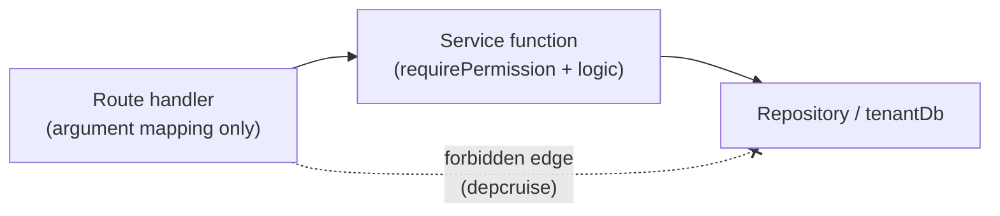
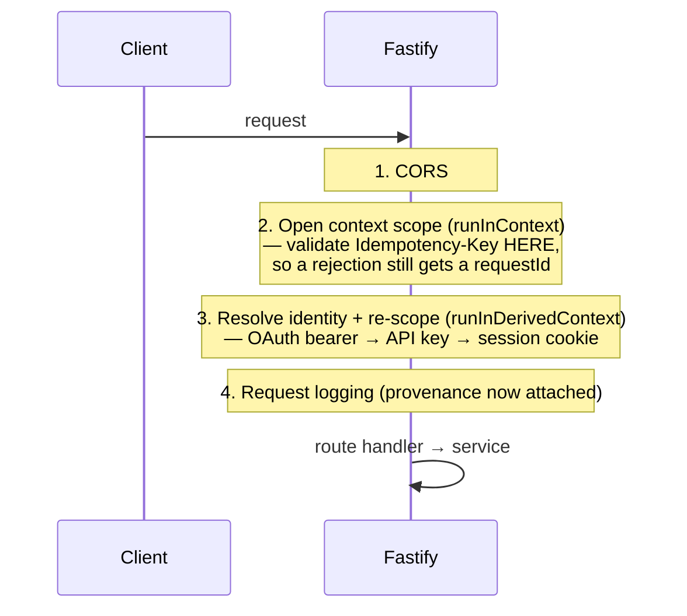
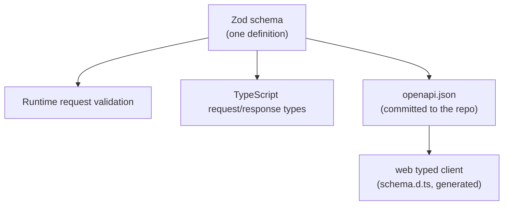
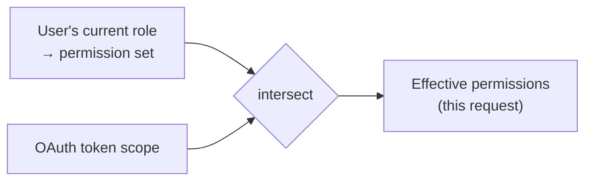

# API & Transport Layer

The API is the product — not the private backend of the web app. This page explains how the
transport layer is built, why it holds no business logic, how one set of Zod schemas produces
validation *and* types *and* the OpenAPI spec, and how permissions are enforced.

Source: `packages/server/src/transport/` and `packages/server/src/modules/permissions/`.

---

## The layering rule: transport holds no business logic

A route file does exactly three things: **parse the request** (with a Zod schema), **call one
service function**, and **map the result to a status and body**. That's it.

```ts
// routes/accounts.ts — the shape of every write route
app.post('/v1/accounts', { schema: createAccountRouteSchema }, async (request, reply) => {
  const result = await withIdempotency(
    { endpoint: 'createAccount', request, successStatus: 201 },
    () => createAccount(request.body),          // ← the only business call
  );
  return reply.status(result.status).send(idempotentBody(result));
});
```

This is enforced, not encouraged. dependency-cruiser's `transport-holds-no-business-logic` rule
forbids the transport layer from importing any `*.repository.ts` or reaching into `src/db/` (except
the public `index.ts`). And `requirePermission` is called **in the service**, never in a route —
enforced by `services-do-not-import-transport`. Shared route plumbing (the idempotency-key header
schema, paged-list query helpers, org-scope hooks) lives in `routes/support.ts` so it isn't
restated per file.



---

## The request lifecycle

`buildApp()` returns a configured Fastify instance rather than listening on import — so `app.inject()`
can exercise the whole stack (hooks, validation, serialisation, error handling) with **no socket**.
That's what makes the transport testable.

The hook order is load-bearing:



- **Step 2 before step 3** so that even a rejected `Idempotency-Key` is logged with a request id.
- **Step 3** resolves identity in a fixed priority order. A handful of "identity-establishing"
  routes (login, register, logout, the two public-invoice routes, the artifact stream) are *exempt*
  from the throwing resolver — because the resolver throws on a stale/forged cookie, which is correct
  for a tenant route but wrong for the routes that exist to *clear* a bad cookie. (This exact bug
  once 401'd every request including login; the fix is these exemptions.)
- Fastify's built-in request logging is disabled because it fires before the context scope exists.

---

## One schema, three outputs

Every route declares its request/response shapes as **Zod schemas**. Those schemas are:

1. **Runtime validation** — Fastify rejects a malformed request before the handler runs.
2. **TypeScript types** — the handler's `request.body` is typed from the schema.
3. **The OpenAPI document** — `fastify-type-provider-zod` transforms the schemas into OpenAPI **3.1**
   (chosen over 3.0 because 3.1's JSON Schema dialect has a real `null` type and doesn't force lossy
   rewrites of nullable/discriminated unions).



### Drift is a build failure

The published spec and the actual behaviour **cannot** diverge, because the gate checks it:

```
yarn drift  =  yarn spec:check  &&  yarn client:check
```

- **`spec:check`** regenerates `openapi.json` in-memory from the live route table (no DB or network
  needed) and diffs it against the committed file. The generator is a *pure function* of the routes —
  keys are recursively sorted so a harmless file split can't produce a false drift.
- **`client:check`** regenerates the web client's `schema.d.ts` from `openapi.json` and byte-compares
  it against the committed one.

The order matters: reversed, a route change would report as *client* drift instead of *spec* drift.
See [Development](../guides/development.md#the-gate-yarn-check).

---

## Idempotency at the boundary

`Idempotency-Key` is validated in an `onRequest` hook (`requireIdempotencyKey`) — the earliest
possible point, so an unguardable write is refused before the body is read. The transport restates
the header limits (presence, blankness, length, no repeated header) rather than importing the
service's; the behavioural guarantee lives entirely in the idempotency module. See
[Money & invariants](money-and-invariants.md#idempotency-retries-are-safe-by-design).

---

## Permissions

### The catalog

`PERMISSION_KEYS` (`modules/permissions/catalog.ts`) is a **closed, hand-written union** of 56
permission keys, pinned by a type-level size assertion. It is *not* derived from the schema
(`permissions.code` is a plain `VARCHAR`, not an enum). Drift between this list and the seeded
`permissions` table is caught by a test asserting set-equality both ways.

The catalog is a separate file from enforcement so dependency-cruiser can let transport import the
permission **type** (for OpenAPI emission) while forbidding it from importing the enforcement module.

### Enforcement

```ts
// In a service — the ONLY place this is called.
export async function createAccount(input: CreateAccountInput) {
  const ctx = getContext();
  await requirePermission(ctx, 'accounts.write');
  // …business logic…
}
```

`requirePermission(ctx, key)`:

- throws `UnauthenticatedError` if the context isn't authenticated (checked *first*, so the reason
  given is correct);
- else throws `PermissionDeniedError(key)` if the resolved permission set lacks the key.

The resolved set is **memoised per request** in a `WeakMap` keyed by the frozen context object —
deliberately *not* a process-lifetime cache, which would keep a demoted user's old permissions until
restart. Concurrent checks within one request coalesce onto one query; a rejection evicts the entry
so a transient DB error doesn't poison the rest of the request.

### OAuth scope narrowing

An OAuth-token context carries a `scopeLimit`. The effective permission set is the **intersection**
of the token's scope with the granting user's *current* role — recomputed per request. So a delegated
token can never exceed its user's role, even if its stored scope is broader, and a role change or
revocation takes effect immediately without touching a token row (decision **D-54**).



### The one advisory list

`GET /v1/auth/me` returns the caller's permission list for the UI to grey out nav items. This is
**advisory only** (decision **D-25**) — it authorises nothing. If any code branches on it to decide
whether to *perform* an operation, that call site is the bug. The real gate is always
`requirePermission` in the service.

---

## Errors on the wire

All errors serialise through `toWireError` to a stable envelope: a machine-readable `code`, a
client-safe `message`, and (for validation errors) field-level detail. The web client maps every
`code` to a `{ title, message, recovery }` presentation, where `recovery` is one of `fix-input`,
`sign-in`, `no-access`, `refresh`, `retry`. Notably `permission_denied` and `not_found` share
identical wording — the A7 indistinguishability rule, one layer up. See
[Money & invariants](money-and-invariants.md#404-never-403).

---

## Public and non-`/v1` surfaces

Not everything lives under `/v1`:

| Path | What | Auth |
| --- | --- | --- |
| `/v1/*` | The permissioned REST API. | Session / API key / OAuth bearer. |
| `/public/invoices/{token}` and `.../pdf` | The hosted invoice page + PDF. | A per-delivery **capability token** in the URL — the one sanctioned unauthenticated read. Resolves org → `tenantDb` from the token. |
| `/artifacts/{key}` | Local storage adapter streams a stored file. | Identity-establishing exemption. |
| `/oauth/authorize`, `/oauth/token`, … | The OAuth 2.1 authorization server. | The OAuth flow itself. |
| `/mcp` | The MCP JSON-RPC host. | Same identity resolvers as REST. |
| `/health` | Liveness. | None. |
| `/docs` | Swagger UI over `openapi.json`. | None. |

The public invoice surface bypasses `requirePermission` by design, so it carries its own security
review obligation. See [Security](security.md).

---

## Related reading

- [Providers & config](providers-and-config.md) — how the app is configured and its swappable seams.
- [Platform & AI](../features/platform-and-ai.md) — OAuth, API keys, MCP, the event feed.
- [Adding a feature](../guides/adding-a-feature.md) — the route→service→spec→client loop in practice.
