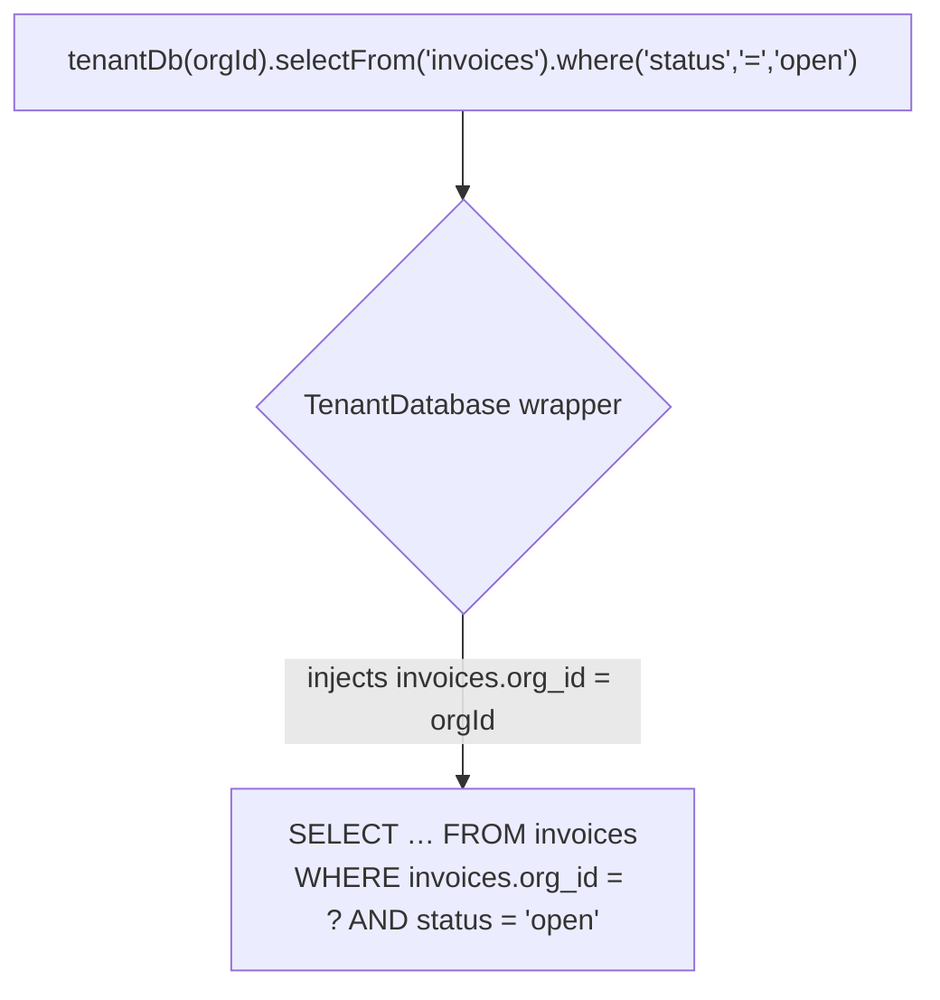
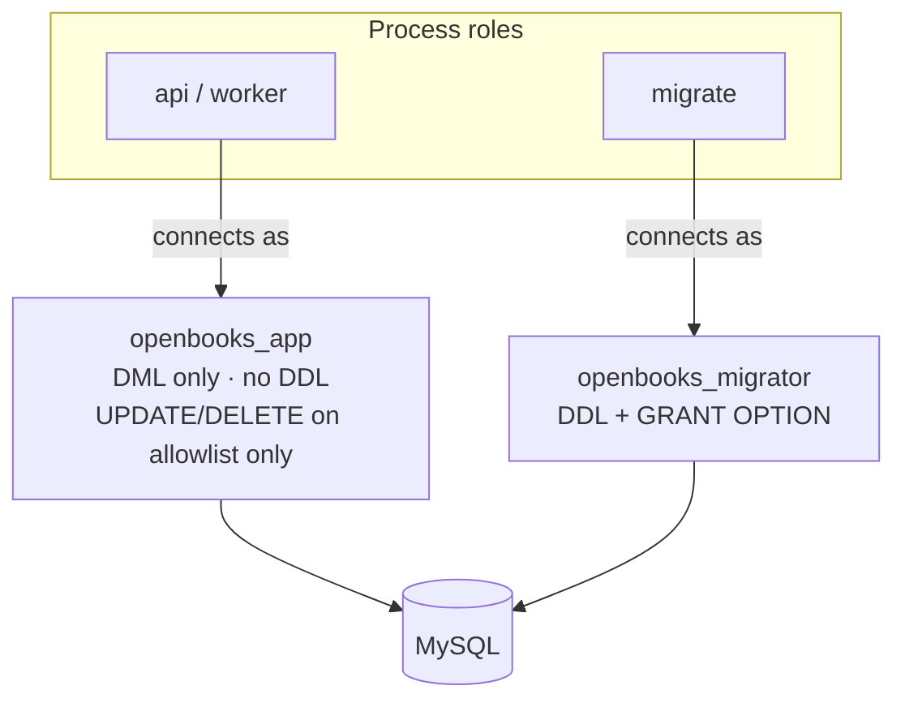
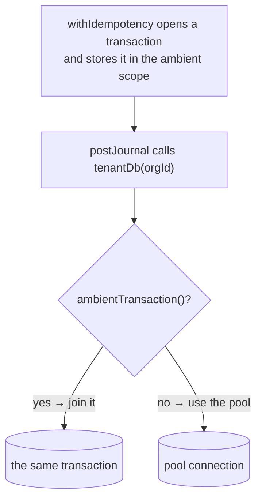

# Data Access & Multi-Tenancy

OpenBooks is multi-tenant: many organisations share one database. The central guarantee is that
**a cross-org read is not merely forbidden — it is unrepresentable.** A query for another org's data
doesn't return an error; the rows never arrive in the first place.

This page covers how tenant scoping works, the two database users, how transactions propagate, and
the migration conventions that keep it all coherent.

Source: `packages/server/src/db/`.

---

## Two ways in: `tenantDb()` and `systemDb()`

There are exactly two public entry points to the database, both re-exported from `src/db/index.ts`:

```ts
import { tenantDb, systemDb } from '../db';

// Tenant-scoped: every query is automatically confined to one org.
const accounts = await tenantDb(ctx.orgId).selectFrom('accounts').selectAll().execute();

// System-scoped: the handful of non-tenant tables (users, orgs, roles, sessions, …).
const user = await systemDb().selectFrom('users').where('id', '=', id).executeTakeFirst();
```

**`tenantDb(orgId)`** returns a wrapper whose every `selectFrom` / `insertInto` / `updateTable` /
`deleteFrom`:

- is restricted at the *type level* to tenant tables only (a non-tenant table won't typecheck);
- has `<table>.org_id = ?` injected into the `WHERE` clause **before** the caller can add anything;
- on insert, has `org_id` **stripped from the accepted shape entirely** — there is nowhere to put a
  wrong one; the org id is spliced in after your values.



So a service author physically cannot write a query that reads another org's rows through
`tenantDb`. The org id comes from the **frozen request context**, never from a parameter the caller
controls.

> **The one documented gap:** `updateTable` does not hide `org_id` from `.set()`. A caller *could*
> move one of their own rows to another org's ownership — but they still cannot read or write another
> org's rows, because the `WHERE` clause still confines the statement to their org. This is an
> accepted, documented limit.

---

## The raw handle is fenced off two ways

The actual Kysely instance lives in `src/db/client.ts` behind a module-private `rawDb()`. It is
never re-exported. Two independent mechanisms keep it unreachable:

1. **Convention** — `src/db/index.ts` re-exports only `tenantDb` and `systemDb`.
2. **Import-graph rule** — dependency-cruiser's `no-raw-db-outside-db-module` fails the build if any
   file outside `src/db/**` imports `client.ts`.

Neither is sufficient alone; together the unsafe path does not exist (decision **D-01**). An unscoped
tenant query simply does not typecheck.

---

## Which tables are tenant tables?

`TenantTableName` is a **derived** type, not a hand-maintained list:

```ts
// A table is a tenant table iff it has a non-nullable org_id column.
type TenantTableName = { [K in keyof DB]: 'org_id' extends keyof DB[K] ? K : never }[keyof DB];
```

So a migration that adds a table with a non-nullable `org_id` is automatically in scope. The runtime
counterpart `TENANT_TABLES` is tied to the derived type with a compile-time exhaustiveness check —
add a tenant table and forget to register it, and the build fails.

**`roles` is deliberately excluded.** Its `org_id` is *nullable*, and `NULL` means a shared system
role visible to all orgs (there are six seeded system roles). A bare `org_id = ?` equality would
hide them. `roles` is accessed via `systemDb()` with an explicit `org_id = ? OR org_id IS NULL`
predicate.

---

## Tenancy is also structural

Type-level scoping is belt; the schema is braces. Every tenant table has a **composite unique key
`(org_id, id)`**, and child rows foreign-key through it:

```sql
-- journal_lines can only reference a journal in the SAME org.
FOREIGN KEY (org_id, journal_id) REFERENCES journals (org_id, journal_id)
```

A child row whose `org_id` disagrees with its parent's is not "rejected by a check" — it is
*impossible to insert*, because there is no parent row with that `(org_id, id)` pair. Cross-org
references are unrepresentable at the storage layer.

---

## The two database users



| User | Holds | Used by |
| --- | --- | --- |
| **`openbooks_app`** | `SELECT`, `INSERT` database-wide; `UPDATE`/`DELETE` per-table on the `MUTABLE_TABLES` allowlist. **No DDL.** | The `api` and `worker` roles (the running server). |
| **`openbooks_migrator`** | `ALL PRIVILEGES … WITH GRANT OPTION`. | The `migrate` role only. It's the only user that can hand out grants, which is how it narrows the app user's privileges. |

The two users are provisioned **identically** in three places, and a script enforces that they don't
drift:

- `docker/mysql-init/` — Compose and testcontainers.
- `infra/db-bootstrap/` — the hosted RDS bootstrap.
- `infra/scripts/check-db-bootstrap-parity.sh` — `cmp`s the shared grant file byte-for-byte and
  fails on divergence.

The `02-grants.sql` file is **shared byte-for-byte** between the Compose and RDS bootstraps. See
[Hosted infra](../guides/hosted-infra.md#the-two-db-user-bootstrap).

---

## Ambient transactions

Here is a subtle correctness problem. Consider:

```ts
await withIdempotency(spec, () => postJournal(input, ctx));
```

`withIdempotency` opens a transaction to insert its claim row. `postJournal` calls `tenantDb(orgId)`,
which builds a wrapper over the *pool*. Without help, the claim and the posting land in **two
separate transactions on two connections** — a rollback of one leaves the other committed, breaking
"a duplicate key yields exactly one journal" (A8).

The fix (`src/db/transaction-scope.ts`) is an `AsyncLocalStorage<Transaction>` holding the **ambient
transaction** for the current async scope. Both `tenantDb()` and `systemDb()` consult it before
falling back to the pool. So any code running inside `withIdempotency`'s transaction automatically
*joins* it — no transaction parameter threaded through every service signature.



Related helpers: `runDetached()` clears the ambient scope for a queued job that will run on a later
event-loop turn (a job enqueued inside a request's transaction must *not* see that
committed/closed transaction); `withTransaction()` is the `systemDb()` counterpart to a tenant
transaction.

---

## Migrations

Migrations are raw `sql` templates (`src/db/migrations/`), not the Kysely schema builder — MySQL
specifics like `BINARY(16)`, `DATETIME(3)`, `ENUM`, `CHECK`, composite FKs, and `REVOKE` are poorly
expressed by the builder. Registration is **static** (`migrations/index.ts`) because the server
bundles into a single file in production — there is no migrations directory on disk to scan.

### The conventions that matter

| Convention | Why |
| --- | --- |
| **Four-digit prefixes**, applied in lexicographic order (`0001_tenancy`, `0002_ledger`, …). | Deterministic ordering. |
| **`0999_app_grants` runs last.** | `GRANT` resolves table names at execution time and errors on a table that doesn't exist yet. Every table it names must be created by an earlier migration. `0999` is the *ceiling* of the four-digit scheme, so "last" is a property of the numbering, not something every future migration must remember. |
| **`0004` is permanently retired.** | It used to be the grants file's number. |
| Money is `BIGINT` minor units; UUIDs are `BINARY(16)` plain byte order; dates are `DATE` read as strings. | See [Money & invariants](money-and-invariants.md). |
| **Pre-release, migrations are edited in place**, not appended (decision **D-15**). | Cleaner history before the schema is public. This inverts permanently at first release. |

The current migration set:

```
0001_tenancy   0002_ledger   0003_idempotency   0005_subledger   0006_banking
0007_invoice_delivery   0008_recurring_dunning   0009_bill_capture
0010_platform   0011_payment_processing   0012_cash_application   0013_pay_bills
0999_app_grants   ← always last
```

### `MUTABLE_TABLES` vs `APPEND_ONLY_TABLES`

These two declarative arrays live in `0999_app_grants.ts`. They must **partition the live schema
exactly** — every table is in one list or the other, with a one-line rationale comment. A test
(`test/enforcement/grants.test.ts`) connects as `openbooks_app` and asserts the partition holds and
that append-only tables refuse updates. Adding a new mutable table means adding a line here.

> **In-place edits have a cost.** If you edit an already-applied migration, your local database is
> now inconsistent with the registry, and `migrate:down` may fail (MySQL DDL/GRANT aren't
> transactional). The fix is to drop and recreate the schema. See the runbook in
> [Database & migrations](../guides/database-and-migrations.md#runbook-reset-after-an-in-place-edit).
> Testcontainers never hit this — they always start fresh.

---

## Code generation

`src/db/generated.ts` is produced by `kysely-codegen` (`yarn codegen`) against a **live migrated
database**, connected as the migrator user. It is marked do-not-edit and excluded from lint. Two
generator defaults are deliberately overridden:

- **`BIGINT → bigint`** (not `number`) — money and `journal_lines.id` need precision above 2^53.
- **`DATE → string`** (not `Date`) — a calendar date has no timezone; building a `Date` invents a
  moment and can land an `entry_date` in the wrong fiscal period.

Because pre-release migrations are edited in place, you **cannot** codegen against your running local
stack (a new migration sorts before the applied `0999` and is refused). Codegen runs against a
**throwaway** MySQL migrated fresh with the full set. See
[Database & migrations](../guides/database-and-migrations.md#regenerating-generatedts).

---

## Related reading

- [Ledger kernel](ledger-kernel.md) — the append-only tables these grants protect.
- [Money & invariants](money-and-invariants.md) — the money primitive and idempotency.
- [Database & migrations guide](../guides/database-and-migrations.md) — the commands and runbooks.
