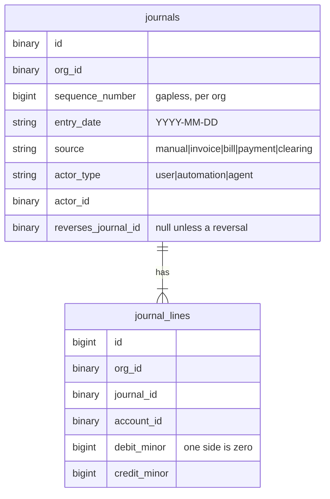
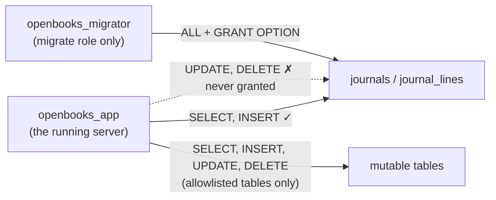
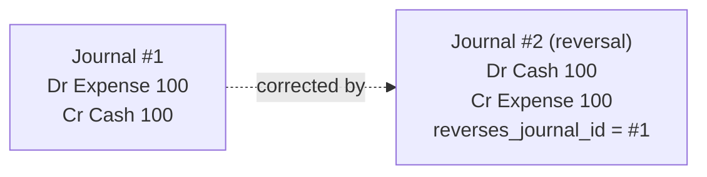
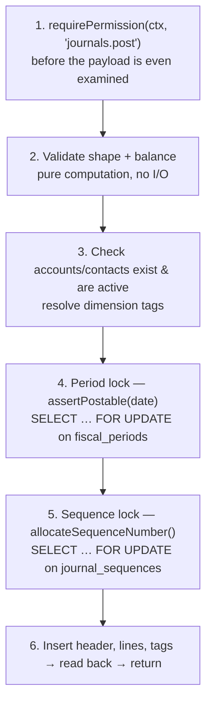
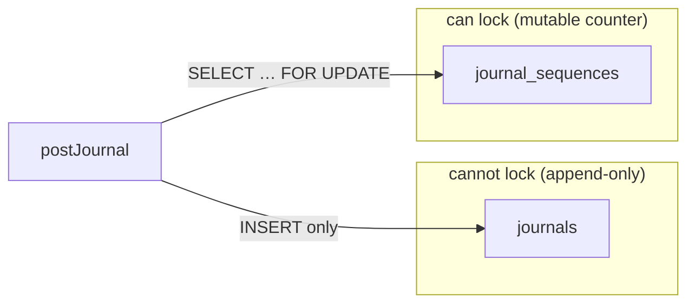

# The Ledger Kernel

This is the heart of OpenBooks. Everything else exists to feed it or read from it. If you
understand this document, you understand why the rest of the architecture is shaped the way it is.

**The one-sentence version:** journals are append-only at the database level, corrections are
reversing entries, and exactly one function in the entire codebase is permitted to write to the
journal tables.

Source: `packages/server/src/modules/ledger/`.

---

## What a journal is

A **journal** is one balanced double-entry transaction. It has a header (`journals`) and two or more
lines (`journal_lines`). Each line is one-sided — a debit _or_ a credit, a positive amount — and the
debits must equal the credits.

There is **no stored balance and no stored status** anywhere. A document's outstanding amount is
`total − allocations`, computed on read. An invoice's status is derived from whether it has a
`journal_id` (approved) or `void_journal_id` (voided). Financial truth is recomputed from
`journal_lines` every time — there is no cache to invalidate and no denormalised figure to drift
(spec §2.6).

---

## Immutability is enforced by the database

The application connects to MySQL as **`openbooks_app`**. That user is granted `SELECT` and `INSERT`
database-wide, and `UPDATE`/`DELETE` **only** on an explicit allowlist of mutable tables. The
journal tables are _not_ on that allowlist.

This is not "the app promises not to update journals." It is "the app _cannot_ update journals — the
grant does not exist." An `UPDATE journals …` from any code path fails at the database with a
privilege error.

> **Why an allowlist and not a revoke?** MySQL privileges are additive across the
> database→table→column hierarchy, and you cannot revoke a privilege at a finer grain than it was
> granted. "Grant everything, then revoke `UPDATE` on two tables" fails outright. So the app user is
> granted narrowly and simply never receives the dangerous privilege. This is spelled out at length
> in `0999_app_grants.ts`. The two lists — `MUTABLE_TABLES` and `APPEND_ONLY_TABLES` — must
> partition the live schema exactly; a test connects **as the app user** and asserts the refusal.

Immutability is enforced at **three independent layers**, so a gap in one is caught by another:

| Layer                                       | Catches                                                                                                                   |
| ------------------------------------------- | ------------------------------------------------------------------------------------------------------------------------- |
| **Database grants** (`0999_app_grants.ts`)  | Any `UPDATE`/`DELETE` on journals from the running app.                                                                   |
| **Lint rule** `openbooks/no-journal-writes` | An unauthorised `INSERT` from the wrong code path (grants allow inserts; this rule confines _which file_ may write them). |
| **Reversing-entry design**                  | The absence of any "edit" affordance in the first place.                                                                  |

---

## Corrections are reversing entries

There is no column anywhere whose value changes after insert. To correct a posted journal you post a
**new** journal with every line's debit and credit swapped and `reverses_journal_id` set to the
original.

A journal may be reversed **at most once** (`uq_journals_org_reverses`), and a race to reverse the
same journal twice is translated into a friendly conflict error rather than a duplicate-key crash.

---

## Only one function writes journals

`posting.repository.ts` is, by lint rule and grant allowlist, _the only code in the system permitted
to write `journals` or `journal_lines`._ It is deliberately the least clever code in the codebase —
pure plumbing:

- `allocateSequenceNumber()` — allocates the next gapless `sequence_number` (see below).
- `selectPostableAccounts` / `selectPostableContacts` — read through the tenant wrapper, so a
  cross-org id simply never appears.
- `insertJournal` / `insertJournalLines` — the lines go in as **one multi-row statement**, so the
  `chk_journal_lines_one_sided` CHECK and the composite foreign keys evaluate as a unit. No
  partially-inserted journal ever exists, even transiently.

Everything that makes a journal _correct_ — balance validation, the period lock, actor provenance —
lives in the layer _above_ this repository, in `posting.service.ts`. That is precisely why nothing
else may write these tables: a second write path would skip all three checks.

---

## The posting sequence, and why the order is fixed

`postJournal` opens **one transaction** and executes a fixed sequence of steps. The order is chosen
so failures happen as early and as cheaply as possible, and so that locks are taken in a globally
consistent order (which is what makes deadlock impossible).

- **Step 1 first** means an unauthorised caller learns nothing about the shape of the API.
- **Steps 4 and 5 are always taken in that order, by every caller.** Two locks acquired in a
  consistent global order cannot deadlock.
- Because everything is in one transaction, a posting that races a period close leaves **no
  half-written journal**: whichever of the period-close `UPDATE` or the posting's `FOR UPDATE` reaches
  the row first serialises the other (acceptance criterion A9).

### Balance validation

Debits and credits are summed as `Money` (a branded `bigint` of minor units) — **exact, no epsilon**.
In minor units there is nothing for a floating-point tolerance to absorb. The database CHECK
guarantees each _line_ is one-sided and positive; it cannot express the cross-row invariant that a
journal's lines sum to zero. That invariant is validated in `posting.service.ts` — and, again, is
exactly why nothing else may write the tables.

---

## The gapless sequence counter

Each org's journals are numbered `1, 2, 3, …` with no gaps. Allocating the next number requires a
locking read (`SELECT … FOR UPDATE`) so two concurrent posts don't collide on a number.

But **you cannot take a locking read on `journals` itself** — MySQL requires `UPDATE`/`DELETE`/`LOCK
TABLES` privileges alongside `SELECT` for a `FOR UPDATE`, and withholding exactly those privileges is
how append-only-ness is enforced. So the counter lives in its **own mutable table**, `journal_sequences`,
which the app _can_ lock (decision **D-14**).

The same pattern recurs for every other resource that needs a gapless, race-safe counter:
`document_sequences` (invoice/bill numbers), `event_positions` (the event log), and
`check_number_sequences` (printed cheques).

---

## Actor provenance

Every posting and reversal **requires** a valid `actorId` (a UUID). A missing actor is treated as a
wiring fault in the caller, not a client error. The journal header carries:

- `actor_type` — `user`, `automation`, or `agent`.
- `actor_id` — who or what did it.
- `invocation_mode` — how an agent was invoked (agent actors only; a CHECK constraint keeps
  `automation` actors from carrying one).

So "who posted this, and was it a human?" is a property of the ledger row itself, not a log line that
can be lost. See also [provenance in logging](money-and-invariants.md#provenance).

---

## Reading the ledger

Reads are deliberately separate service objects from writes, so a read-only caller can never hold a
posting handle:

- `getTrialBalance` — the oracle. Every property test checks its own computation against this.
- `listJournals` — the journal register.

All reporting (`profit-and-loss`, `balance-sheet`, `general-ledger`, `aging`, cash-basis, cash-flow)
is a thin projection over one shared aggregation of `journal_lines`. See
[Reporting & tax](../features/reporting-and-tax.md).

---

## Drafts: the "not yet happened" workspace

A manual journal entry is composed as a **draft** first (`journal_drafts`). A draft is mutable,
freely discardable, appears in no report, satisfies no ledger invariant, and carries **no sequence
number** (which would leave a gap on discard) and **no period** (resolved from `entry_date` only at
post time, so it can't go stale). `postDraft` runs `postJournal` and deletes the draft in one
transaction. See [Platform & AI → drafts](../features/platform-and-ai.md#drafts) — the same drafts
mechanism is what the AI `journal.propose` tool lands into.

---

## The acceptance criteria this kernel delivers

| Criterion | Guarantee                                                                       |
| --------- | ------------------------------------------------------------------------------- |
| **A3**    | A journal's debits equal its credits — validated exactly in minor units.        |
| **A4**    | Posting into a locked period is rejected.                                       |
| **A7**    | A cross-org read is indistinguishable from a non-existent one (404, never 403). |
| **A8**    | A duplicate idempotency key yields exactly one journal.                         |
| **A9**    | A posting racing a period lock leaves no half-written journal.                  |
| **A13**   | Every log line carries actor provenance.                                        |

Related reading: [Data & tenancy](data-and-tenancy.md) (the two DB users, tenant scoping),
[Money & invariants](money-and-invariants.md) (the money primitive, idempotency, property testing).
