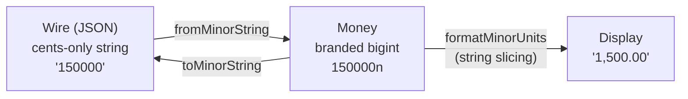
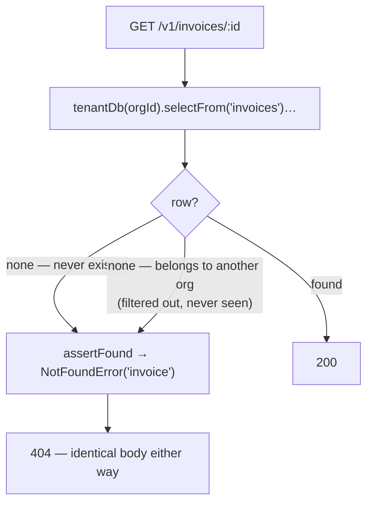

# Money, Idempotency & Invariants

Three cross-cutting concerns that show up in nearly every subsystem: how money is represented, how
retries are made safe, and how correctness is *proven* rather than assumed. Getting any of these
wrong is subtle and expensive, so each is handled once, centrally, and enforced.

---

## Money is `bigint` minor units, end to end

A monetary amount is a **whole number of minor units** (cents), held as a `bigint`. `$1,500.00` is
`150000n`. There is no `DECIMAL`, no float, no `Number` anywhere in the money path.



### On the wire it is a string, never a number

Money crosses the API as a **cents-only string** — `"150000"` — never a JSON number (decision
**D-13**). Two reasons:

- JSON numbers are IEEE-754 doubles; `9007199254740993` (just above 2^53) cannot be represented, and
  large ledgers exceed that.
- A decimal string (`"1500.00"`) invites `Number(x) / 100`, which yields artifacts like
  `1234.5599999999999`.

`fromMinorString` **rejects** `"1500.00"` — the canonical form is integer-only.

### Arithmetic goes through helpers, and the unsafe spelling is unavailable

`@openbooks/shared-types` exposes the only sanctioned operations: `add`, `subtract`, `negate`, `sum`,
`scale`, `allocate`. Direct arithmetic on money is not "discouraged" — it is a **lint error**. The
custom `openbooks/no-float-money` rule is type-aware: it detects the branded `Money` type
structurally and bans `+ - * / %`, `Number(money)`, `Math.*(money)`, and compound assignment on
money operands.

```ts
const total = add(subtotal, tax);        // ✓ sanctioned
const total = subtotal + tax;            // ✗ lint error: no-float-money
```

### Formatting is string manipulation

`formatMinorUnits("150000")` inserts the decimal point by **slicing the string**, never by dividing.
`cents / 100` in floating point is exactly the bug the whole scheme exists to prevent. Parsing the
other way (`toMinorUnits`) **throws** on excess precision (`"1.005"`) rather than silently rounding —
rounding is reserved for the single deliberate point where `allocate` distributes a remainder.

### The client mirrors it independently

The web app has its **own** cents-string implementation (`packages/web/src/money/format.ts`) — not
imported from `shared-types`, because that package isn't a web dependency. Same rules: regex-validate
the canonical integer string, slice to format, throw on excess precision, collapse `"-0"` to
`"0.00"`. The only component allowed to do the conversion is `<MoneyInput>`.

---

## Idempotency: retries are safe by design

**Every write endpoint requires an `Idempotency-Key` header.** This is not optional and not
best-effort — the typed client won't compile a write without one, and the server refuses an
unguarded write in an `onRequest` hook, before the body is even read.

Source: `packages/server/src/modules/idempotency/`.

### The mechanism

The claim row is inserted **in the same transaction** as the guarded write. That single fact
delivers both guarantees:

```mermaid
sequenceDiagram
    participant R1 as Request A
    participant R2 as Request B (same key)
    participant DB as MySQL

    R1->>DB: BEGIN; INSERT claim (org, key)
    R2->>DB: BEGIN; INSERT claim (org, key)
    DB-->>R2: blocks on unique index uq_idempotency_org_key
    R1->>DB: run operation; store response; COMMIT
    DB-->>R2: ER_DUP_ENTRY (A committed first)
    R2->>DB: read committed claim → replay stored response
```

| Guarantee | How |
| --- | --- |
| **Exactly one execution under a race** | Two concurrent requests both `INSERT` the same key; the unique index serialises them. The second blocks, then fails `ER_DUP_ENTRY`, then replays the first's stored response. The guarantee is MySQL's unique index, not a check-then-act. |
| **A failure is not poison** | If the operation throws, the claim rolls back *with it* — no committed row — so a genuine retry re-claims and re-executes. |

### Replay, conflict, and fingerprints

On a repeat request with a completed, non-expired claim:

- If the **request fingerprint** matches, the stored response is replayed verbatim.
- If it differs (same key, different body), a **409 conflict** is raised — never a silent
  re-execution or a wrong replay.

The fingerprint uses a custom type-tagged canonical encoding, **not** `JSON.stringify` — which throws
on `bigint` money and collapses `1` vs `'1'`.

Retention is **7 days** and is *not* configurable (a correctness window as a deployment knob invites
someone shortening it and rediscovering why it existed). Two namespaces exist: org-scoped claims, and
a separate org-less namespace for the five pre-org writes (register, login, logout, create-org,
switch-org), whose fingerprint also folds in the caller's `userId`.

### The one thing a caller must get right

`withIdempotency(spec, operation)` hands the `operation` callback a transactional, org-scoped handle
that it **must use**. A callback that ignores it and calls `tenantDb(...)` itself opens a *second*
transaction and silently defeats every guarantee. For the ledger this is resolved by ambient
transaction propagation (see [Data & tenancy](data-and-tenancy.md#ambient-transactions)), so
`withIdempotency(spec, () => postJournal(input, ctx))` composes correctly.

---

## 404, never 403

A cross-org read must be **byte-for-byte indistinguishable** from a read of something that never
existed (acceptance criterion **A7**). A 403 would itself leak existence — it confirms the id is real.

Three things make 404 the default:

1. `tenantDb()` injects the org filter, so a cross-org row **never arrives**.
2. `assertFound(value, resource)` is the *single* sanctioned way to turn "no row" into a thrown
   error — so "never existed" and "exists but isn't yours" are literally the same line of code.
3. `NotFoundError` accepts only a validated resource **token** — no message, no id echo, no details
   bag. Two different reasons produce identical output by construction; constructing one with a
   distinguishing string throws.



The error taxonomy that supports this:

| Error | Status | Rule |
| --- | --- | --- |
| `NotFoundError` | 404 | Takes a resource token only. The default for anything a caller can't see. |
| `PermissionDeniedError` | 403 | Takes a permission key only. Thrown *only* by `requirePermission` for a caller lacking a role-granted permission — never for an object lookup. |
| `UnauthenticatedError` | 401 | Takes no message at all — "no such user" and "wrong password" must stay indistinguishable or login becomes an enumeration oracle. |
| `PreconditionFailedError` | 412 | Well-formed and permitted, but current state forbids it (e.g. posting to a closed period). Distinct from validation because the fix differs. |

`toWireError` is the single serialisation point; an unrecognised error becomes a bare
`internal_error` (never `String(error)`, which could leak a connection string), and details are
stripped unconditionally on internal errors.

---

## Provenance

Every log line automatically carries **who did it** (`requestId`, `orgId`, `userId`, `roleId`,
`actorType`, `actorId`). This is a property of the *logger*, not something a call site must remember:
pino's `mixin` reads the frozen request context on every log call. A caller's own fields cannot
override the provenance — "evidence a call site can overwrite is not evidence" (acceptance criterion
**A13**). All logging goes through this logger; `console.*` is a lint error.

---

## Proving correctness: property & mutation tests

Two habits this project has earned the hard way (from `CLAUDE.md`):

- **Prove contention, don't assume it.** Concurrency tests park one transaction mid-flight and assert
  the other has *not* settled. A sequential simulation of a race passes against code that has no
  locking at all — so it proves nothing. `openAppConnection()` gives a genuinely separate connection
  for this.
- **Mutation-test anything load-bearing.** Two mutations once passed the entire example suite and
  were caught only by property tests — including permuting accounts in a reversal instead of swapping
  sides, which is *identical to correct* on a two-line journal, and two-line journals were all the
  example suite posted. A suite that has never failed is of unknown value.

Property suites (via `fast-check`) generate and post journals against **real MySQL**, then check
invariants — e.g. one banking suite computes the cleared balance four independent ways over four
tables and asserts they're equal. See [Testing](../guides/testing.md).

---

## Related reading

- [Ledger kernel](ledger-kernel.md) — where balance validation and posting locks live.
- [Data & tenancy](data-and-tenancy.md) — tenant scoping and ambient transactions.
- [API & transport](api-and-transport.md) — where the `Idempotency-Key` is validated.
