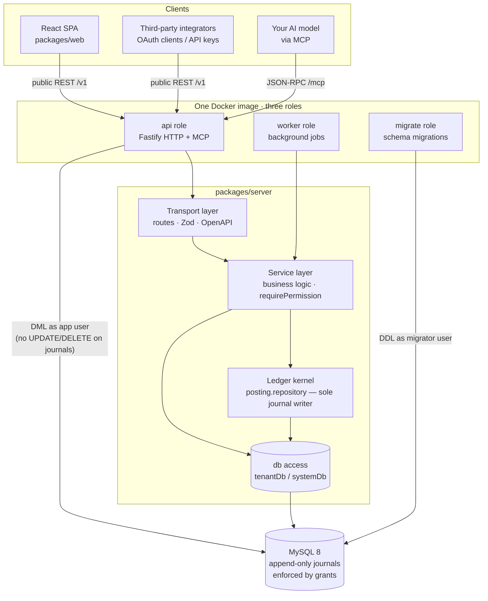
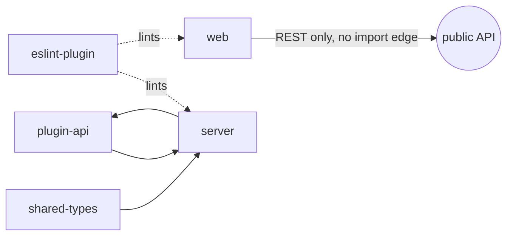

# Architecture Overview

OpenBooks is a double-entry accounting system built around one uncompromising idea: **the ledger
is the only holder of financial state, and it is append-only**. Everything else in the system —
tenancy, the API, the SPA, the AI surface, reporting — is arranged so that this one property can
never be violated, by any code path, by accident or on purpose.

This page is the map. Each claim here is expanded in a dedicated doc, linked inline.

---

## The shape of the system



The critical detail is at the bottom edge: the `api` and `worker` roles connect to MySQL as
**`openbooks_app`**, a user that *does not hold* `UPDATE` or `DELETE` on the journal tables. Only
the `migrate` role connects as **`openbooks_migrator`**, and only to change the schema. Immutability
is therefore a property of the database, not of the application. See
[Ledger kernel](ledger-kernel.md) and [Data & tenancy](data-and-tenancy.md).

---

## The monorepo

A Yarn 4 workspace. Six packages, each with a single job.

```
packages/
  plugin-api/      The internal module contract (the posting interface). Apache-2.0.
  shared-types/    Zod schemas + the money primitive. Validators, types, OpenAPI source — at once.
  server/          Fastify API, MCP server, worker, ledger kernel, migrations. AGPL.
  web/             React SPA — a client of the public API, with no privileged access. AGPL.
  eslint-plugin/   Project-specific lint rules that enforce the ledger's invariants.
  e2e/             Playwright — one narrative per milestone, not a suite.
infra/             Terraform for the hosted stack, plus database bootstrap and nginx.
scripts/           Build scripts (esbuild server bundle, codegen).
```

Internal packages (`plugin-api`, `shared-types`) are **consumed from source everywhere** — dev,
tests, and the production esbuild bundle all resolve them to `src/index.ts`. There is no
dist-vs-src split to keep straight.

The dependency direction is enforced by [dependency-cruiser](../guides/development.md#architectural-boundaries):
`web` may import neither `server` nor `plugin-api` (it talks only to the public API); `plugin-api`
is a leaf and depends on nothing in the tree; the transport layer may not reach into the database;
services may not import transport.



---

## Layers inside the server

A request crosses four layers, and each layer has exactly one responsibility. The boundaries
between them are compiler- and lint-enforced, not aspirational.

| Layer | Responsibility | Enforced boundary |
| --- | --- | --- |
| **Transport** (`src/transport/`) | Parse the request with a Zod schema, call one service function, map the result to a status code. **No business logic.** | Cannot import a `*.repository.ts` or reach into `src/db/` (except the public `index.ts`). |
| **Service** (`src/modules/*/`) | The business logic. This is the only layer that calls `requirePermission`. | Cannot import `src/transport/` (one narrow carve-out: the MCP host). |
| **Ledger kernel** (`src/modules/ledger/posting.repository.ts`) | The *only* code permitted to write `journals`/`journal_lines`. | Enforced by the `openbooks/no-journal-writes` lint rule. |
| **Data access** (`src/db/`) | Tenant-scoped and system-scoped query builders. The raw handle is module-private. | Only `src/db/**` may import the raw Kysely client. |

Because these boundaries are enforced, a whole class of mistakes is simply unrepresentable: a route
handler can't sneak a business rule in, a service can't skip permission checks by writing SQL
directly, and no second code path can write a journal that bypasses balance validation.

See [API & transport](api-and-transport.md) for the request lifecycle in detail.

---

## The request lifecycle

Every HTTP request that reaches a `/v1` route passes through the same ordered hook chain before a
handler runs:

```mermaid
sequenceDiagram
    participant C as Client
    participant F as Fastify
    participant Ctx as Context scope (ALS)
    participant Auth as Identity resolvers
    participant S as Service
    participant DB as MySQL (app user)

    C->>F: HTTP request (+ Idempotency-Key on writes)
    F->>F: 1. CORS
    F->>Ctx: 2. Open async-local context scope<br/>(validate Idempotency-Key here)
    Ctx->>Auth: 3. Resolve identity<br/>(OAuth bearer → API key → session cookie)
    Auth->>Ctx: Re-scope with org/user/role (frozen context)
    Ctx->>F: 4. Request logging (provenance attached)
    F->>S: Handler maps args → service call
    S->>S: requirePermission(ctx, 'permission.key')
    S->>DB: tenantDb(orgId) … one transaction
    DB-->>S: rows (org-scoped; a cross-org row never arrives)
    S-->>C: result → status + body
```

Three things happen here that the rest of the architecture depends on:

1. **The context is frozen.** `orgId`, `userId`, `roleId`, and the actor identity are set once, in
   an immutable object held in `AsyncLocalStorage`. Nothing downstream can mutate the scope of an
   in-flight operation. This is what makes cross-tenant leakage a structural impossibility rather
   than a review item.
2. **Identity resolution is a total order**, not a race: an OAuth bearer token, then an API key,
   then a session cookie. Each resolver returns `null` for a credential that isn't its kind and
   throws only for one that is but is invalid.
3. **Provenance is attached to the logger, not the call site.** Every log line automatically carries
   who did it — see [Money & invariants](money-and-invariants.md#provenance).

---

## One image, three roles

The production artifact is a **single Docker image**. Which process it becomes is chosen at boot by
one environment variable:

```
OPENBOOKS_ROLE=api      # Fastify HTTP server + in-process MCP host
OPENBOOKS_ROLE=worker   # background job consumer (queue-driven)
OPENBOOKS_ROLE=migrate  # runs schema migrations to completion, then exits
```

An unrecognised role **fails the process at startup** rather than defaulting to something. The
hosted service runs the exact artifact you can self-host — there is no separate enterprise build and
nothing in the image branches on which environment it's in. See [Deployment](../guides/deployment.md).

Migrations are always a **discrete job**, never a boot-time step: in Compose and in production the
`api`/`worker` services do not start until the `migrate` job has exited zero.

---

## The API is the product

The public REST API is a first-class surface, not the private backend of the web app with docs
bolted on:

- The React frontend has **no privileged path**. If the frontend can do it, an integrator can, via
  the same endpoint.
- Third parties integrate as **OAuth clients** with scoped, revocable access — never a shared admin
  credential.
- **Every write endpoint takes an `Idempotency-Key`.** Retries are safe by design. The typed client
  won't even compile a write call without one.
- The **OpenAPI description is generated from the same Zod schemas** that validate requests, is
  committed to the repo, and **drift is a build failure** — the published spec and the actual
  behaviour cannot diverge.
- There is a **change feed** and an **event bus** for integrators who need to follow activity rather
  than poll it.

See [Platform & AI](../features/platform-and-ai.md) and [API & transport](api-and-transport.md).

---

## Bring-your-own-model AI

The AI surface is an **MCP server** (`POST /mcp`) mounted on the same Fastify instance as REST. It
exposes a focused set of tools that are thin wrappers over the *same* service functions — same input
schemas, same `requirePermission` checks — as the equivalent REST routes. You connect the model you
already pay for; there is no vendor model in the middle of your financial data.

Crucially, **an AI cannot post to the ledger**. The one write tool (`journal.propose`) lands a
*draft* that a human with the `agents.review` permission must approve. Agent actions carry actor
provenance (`actorType: 'agent'`) on the journal itself. See
[Platform & AI](../features/platform-and-ai.md).

---

## Licensing, in one breath

Dual-licensed. The server and web app are **AGPL-3.0** (the hosted service runs the same image, and
the AGPL's network-use clause keeps a hosted fork from taking the work private). The contract
packages — `plugin-api` and the published OpenAPI description — are **Apache-2.0 with a linking
exception**, because their entire purpose is to be built against. Integrate as an external OAuth
client and you combine with no copyleft code at all. [NOTICE](../../NOTICE) is authoritative.

---

## Where to go next

- The kernel that everything else protects: **[Ledger kernel](ledger-kernel.md)**.
- How multi-tenancy and the two database users work: **[Data & tenancy](data-and-tenancy.md)**.
- The subsystems built on top: **[Features overview](../features/overview.md)**.
- Get it running: **[Getting started](../guides/getting-started.md)**.
