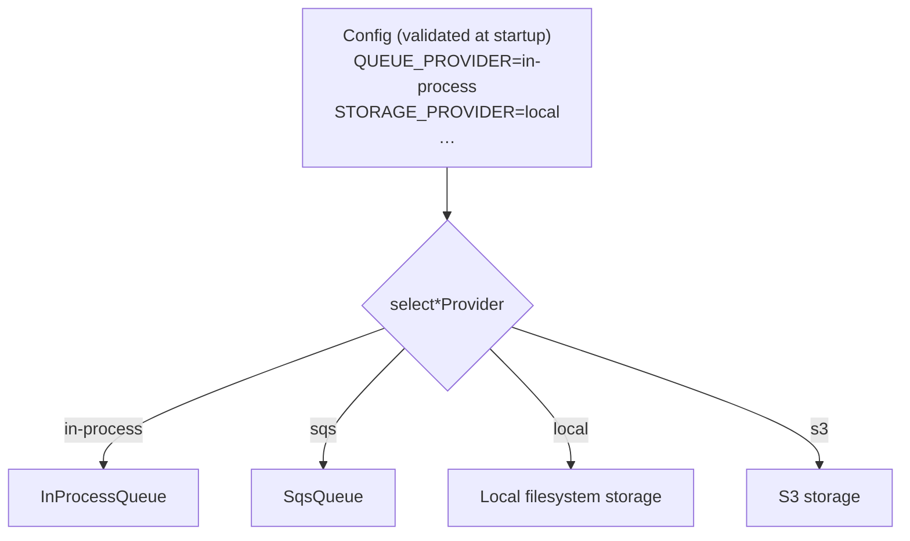
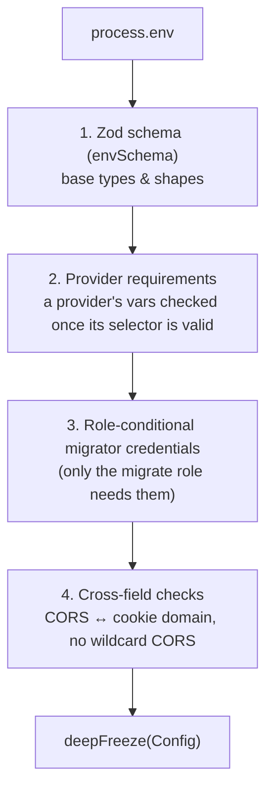

# Providers & Configuration

OpenBooks runs the **same image** whether you self-host on a single container or operate it as a
hosted service on AWS. What differs between those worlds — where files are stored, how jobs are
queued, how email is sent — is isolated behind **provider seams**, selected by environment
variables and validated at startup.

Source: `packages/server/src/providers/` and `packages/server/src/config/`.

---

## The provider seam pattern

Each external dependency is an **interface** with two or more adapters. A single lazily-memoised
accessor returns the one selected by config:

```ts
// providers/index.ts — one accessor per seam, each a function (never a const)
export const storageProvider = () => /* selected adapter */;
export const queueProvider = () => /* … */;
export const secretsProvider = () => /* … */;
```

Every accessor is a **function**, so importing the module never validates env or constructs a client
as a side effect. Each has a matching `set*Provider(value)` installer used only by tests and hosts —
this is deliberately _not_ a general provider registry ("a registry now would be a shape designed
against a single use").



### The seams that exist

| Seam                          | Self-host default       | Hosted adapter        | Notes                                                                                                                   |
| ----------------------------- | ----------------------- | --------------------- | ----------------------------------------------------------------------------------------------------------------------- |
| **Queue**                     | `in-process`            | `sqs`                 | In-process jobs run in whichever process enqueued them. `sqs` ships with its first consumer, the multi-instance worker. |
| **Storage**                   | `local` (filesystem)    | `s3`                  | Local `signedUrl` returns an app-relative `/artifacts/<key>` path the API streams; s3 is a real presigned GET.          |
| **Secrets**                   | `local` (AES-256-GCM)   | `aws-secrets-manager` | Local encrypts with a key derived from `SECRETS_ENCRYPTION_KEY`.                                                        |
| **Email (outbound)**          | `log`                   | `ses`                 | `log` writes the message to the logger — no account needed to develop.                                                  |
| **Document extraction** (OCR) | `deterministic`         | `anthropic`           | `deterministic` is a real key:value parser; `anthropic` is a config-shape placeholder.                                  |
| **Inbound mail**              | `dev` (JSON webhook)    | `ses-inbound`         | Routes forwarded bills to bill capture.                                                                                 |
| **Bank feed**                 | `csv-ofx` (file import) | —                     | No hosted aggregator in v1 (decision **D-41**).                                                                         |
| **Payment processor**         | `fake`                  | `stripe`, `square`    | Used by payments-processing; the `fake` drives the hermetic test gate.                                                  |

### The local-vs-hosted idiom (D-07)

Two rules keep the seams honest:

1. **The self-host default is always the zero-external-dependency choice** — in-process queue, local
   filesystem, locally-encrypted secrets, log email. A single-container Compose stack never needs an
   AWS account.
2. **Each adapter ships with its first genuine consumer.** Writing an adapter with no consumer means
   it's untested — so hosted adapters are added when the multi-instance code that needs them is
   built, not speculatively. Several hosted adapters (`sqs`, `anthropic`, `ses-inbound`) currently
   _throw_ at construction with a message pointing at the decision that deferred them.

---

## Configuration

`getConfig()` (`config/index.ts`) is a **lazily-memoised function**, not an exported constant — so
importing the config module never validates the environment as a side effect (a `tsx` script or unit
test whose import graph happens to mention config shouldn't crash). It loads once and the result is
deep-frozen.

### Validation is fail-fast and staged



- Each provider's config is a **discriminated union** keyed on `provider`, not a bag of optional
  fields. Once validation passes, `sqs.queueUrl` is _non-optional_ — no call site re-checks what
  startup proved.
- `PROVIDER_REQUIREMENTS` is a fully-typed table mapping `(selector, provider) → required env vars`,
  exhaustive by construction: add a provider without a row and it fails to compile.
- Cross-field checks refuse a `CORS_ALLOWED_ORIGINS` containing `*` (credentialed requests can't use
  wildcard CORS) and require `SESSION_COOKIE_DOMAIN` when CORS is enabled (the session cookie is
  `SameSite=Lax` and would otherwise silently never be sent).

### `process.env` goes through config, or nowhere

The `openbooks/no-process-env` lint rule bans `process.env` access outside `src/config/**` (plus a
few explicitly carved-out test/tooling files). The fail-fast validation only holds if _every_
environment read goes through the validated object — a stray `process.env.FOO` elsewhere bypasses it.

### Roles

`resolveRole(env)` reads `OPENBOOKS_ROLE`, defaults to `api` when unset, and **throws** on anything
unrecognised (fails fast rather than silently defaulting on a typo). The migrator credentials are
present in `Config` _only_ for the `migrate` role — so the `api`/`worker` roles can never even be
handed DDL credentials. See [Deployment](../guides/deployment.md).

---

## Entry points

`src/entrypoints/main.ts` is the single production entry point. It resolves the role and dynamically
imports exactly one of:

- **`api.ts`** — initialises the DB pool, does a real `select 1` reachability check _before_
  listening (mysql2's pool is lazy, so a bad host would otherwise first surface as a request-time
  500), wires the three identity resolvers, builds Fastify, and — **only under `QUEUE_PROVIDER=in-process`** —
  registers every job handler and starts the daily tick (under the in-process adapter, the enqueuing
  process is the only consumer).
- **`worker.ts`** — same DB init, registers the job handlers unconditionally, then blocks forever
  (a clean exit is an outage — the Compose worker is `restart: unless-stopped`).
- **`migrate.ts`** — requires the migrator credentials, runs migrations, prints applied/pending, and
  exits non-zero on failure (gating the Compose dependency so the API never starts against a schema
  that failed to migrate).

---

## Where configuration lives, at a glance

| File                  | Holds                                                               |
| --------------------- | ------------------------------------------------------------------- |
| `.env.example`        | Every variable, documented, with dev-safe defaults. Copy to `.env`. |
| `config/env.ts`       | The Zod `envSchema` and `PROVIDER_REQUIREMENTS` table.              |
| `config/config.ts`    | `loadConfig` + the staged validation and cross-field checks.        |
| `config/role.ts`      | `PROCESS_ROLES` and `resolveRole`.                                  |
| `config/providers.ts` | `SELF_HOST_PROVIDERS` defaults.                                     |

See [Getting started](../guides/getting-started.md) for the minimal set to run locally, and
[Deployment](../guides/deployment.md) for the production values.

---

## Related reading

- [API & transport](api-and-transport.md) — how config feeds the running server.
- [Deployment](../guides/deployment.md) — the Docker image and env at deploy time.
- [Hosted infra](../guides/hosted-infra.md) — where the hosted adapters point.
