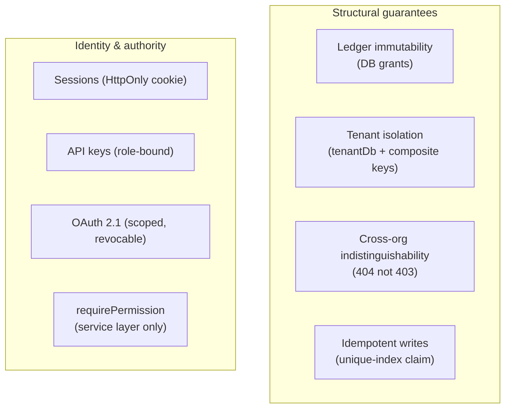

# Security & Threat Model

This page consolidates the security posture that is otherwise spread across code comments and
decision records. It is not a formal audit — it is the mental model a developer should hold, plus the
list of reviews still owed before production.

---

## What we defend, and how

### 1. Ledger immutability

The running app connects as a user with **no `UPDATE`/`DELETE` on the journal tables**. This is
enforced by MySQL grants, backed by a lint rule confining inserts to one file, backed by the
reversing-entry design that offers no edit affordance. An attacker who achieves arbitrary
application code execution still cannot silently alter a posted journal — the privilege does not
exist on the connection. See [Ledger kernel](ledger-kernel.md).

### 2. Tenant isolation

Every tenant query is confined to one org by `tenantDb(orgId)`, where `orgId` comes from the
**frozen request context**, never a caller parameter. The schema reinforces it structurally: composite
`(org_id, id)` keys make a cross-org foreign-key reference impossible to insert. See
[Data & tenancy](data-and-tenancy.md).

### 3. Cross-org reads are indistinguishable from misses

A cross-org read returns **404, never 403** — a 403 would confirm the object exists. The same applies
one layer earlier: login returns no distinction between "no such user" and "wrong password", so it
can't be used as a user-enumeration oracle. See [Money & invariants](money-and-invariants.md#404-never-403).

### 4. Authentication surfaces

Identity is resolved in a fixed priority order — **OAuth bearer → API key → session cookie** — each
resolver returning `null` for a credential that isn't its kind and throwing only for one that is but
is invalid.

| Surface | Credential | Storage | Revocation |
| --- | --- | --- | --- |
| **Sessions** | `HttpOnly; SameSite=Lax` cookie, server-side, unsigned | Hashed with a *fast* hash (it's a lookup, not a password) | Server-side; a revoked session is dead immediately |
| **API keys** | `key_prefix.secret`, opaque | `key_prefix` + SHA-256 hash | Revoke the row; each key carries its *own* role, not the issuer's (a demoted issuer's key doesn't retain authority — D-55) |
| **OAuth tokens** | Opaque bearer (not JWT) | Hashed like API keys | Revoke the row; effective scope is recomputed against the user's *current* role every request (D-54) |
| **Passwords** | — | Argon2id with tuned cost parameters (memory tuned for concurrent hashing on an unauthenticated endpoint) | — |

Opaque tokens (not JWT) were a deliberate choice (decision **D-53/D-61**) so that revocation is
immediate and authority is never carried in a self-contained, un-revocable token.

### 5. Authorization

`requirePermission(ctx, key)` is called **only in the service layer** — never in transport, never in
the SPA. The permission list the UI receives is **advisory** (greys out nav) and authorises nothing
(decision **D-25**). OAuth scope narrows authority by intersection with the user's live role, so a
token can never exceed its granting user. See [API & transport](api-and-transport.md#permissions).

### 6. AI cannot post

The MCP tool surface exposes reads plus one write tool, `journal.propose`, which lands a **draft** — a
human with `agents.review` must approve it before anything posts. There is no execute path for a
ledger-writing tool at all (decisions **D-59, D-60**). Agent actions carry `actorType: 'agent'` on
the journal. See [Platform & AI](../features/platform-and-ai.md).

### 7. Secrets at rest

Payment-processor credentials are never stored inline. They live in a dedicated `secrets` table
(AES-256-GCM at rest under the `local` provider, or AWS Secrets Manager when hosted), referenced by
`secret_ref`. The management API is **write-only** — a stored secret is never read back to a client.
See [Payments processing](../features/payments-processing.md).

### 8. Idempotency / replay safety

Every write requires an `Idempotency-Key`; the claim row shares the write's transaction, so a
duplicate under a race collapses to exactly one execution and a failure leaves no poison row. Webhook
handlers add a second layer (event-id + object-id). See
[Money & invariants](money-and-invariants.md#idempotency-retries-are-safe-by-design).

---

## Privacy-preserving surfaces

- **The hosted invoice page** (`/public/invoices/{token}`) is the *one* sanctioned unauthenticated
  read. It's gated by a per-delivery **capability token** (`prefix.secret`, stored as prefix +
  SHA-256 hash, no expiry) — the whole authorization is the token. It resolves org → `tenantDb` from
  the token, so tenant isolation still holds below it, and it exposes a customer-safe projection with
  no internal ids.
- **The change feed / event log** is tenant-scoped like everything else — an integrator following
  activity sees only their org's events.

---

## Reviews owed before production

These are tracked honestly in the roadmap and should not be forgotten:

| Item | What it is |
| --- | --- |
| **OB-098 — OAuth AS review** | The authorization server was built to spec in-house; a dedicated *external* security review is owed before it faces production traffic. |
| **Public invoice endpoint** | The unauthenticated hosted-invoice surface bypasses `requirePermission` and gets its own security review (a new surface that skips the normal gate). |

Both are deliberate "build-to-spec now, review before prod" decisions, not oversights.

---

## Known lean-v1 edges (payments)

Flagged in the roadmap for hardening later, not correctness bugs today: real Stripe/Square are proven
only in a manual sandbox run (the gate runs the `fake`); the poll cursor is a timestamp rather than a
dedicated event-id column; chargeback losses code to the fee account pending a dedicated loss
account; currency is hard-coded USD. See [Payments processing](../features/payments-processing.md).

---

## Related reading

- [Ledger kernel](ledger-kernel.md) · [Data & tenancy](data-and-tenancy.md) ·
  [Money & invariants](money-and-invariants.md) · [API & transport](api-and-transport.md)
- [Platform & AI](../features/platform-and-ai.md) — OAuth, API keys, MCP in full.
