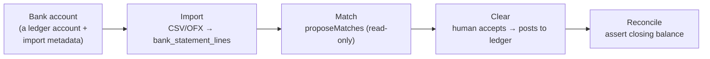
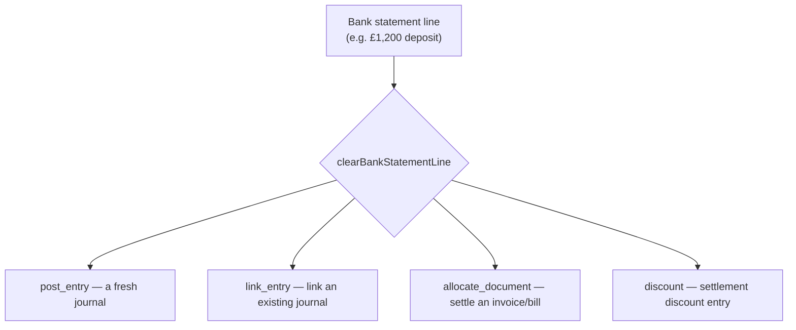
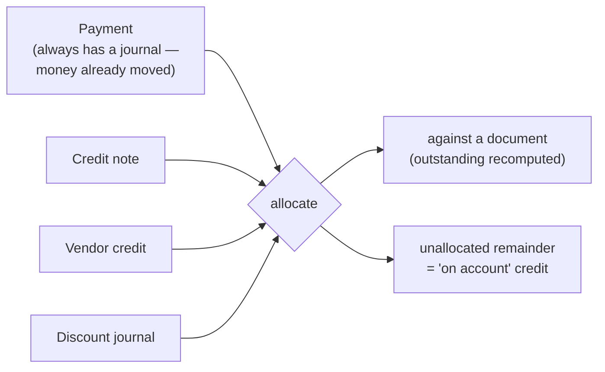
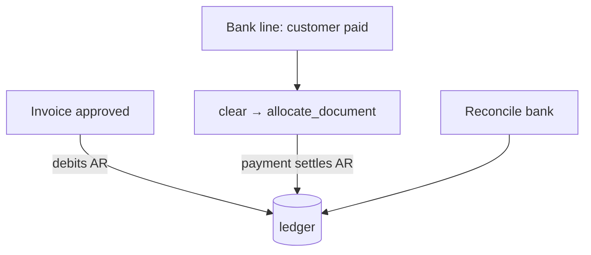

# Cash & Banking

How money movement enters the ledger: importing a bank statement, matching its lines to what the
books already know, posting the accepted matches, and reconciling the account. Plus the cash-receipts
and allocation mechanism that settles invoices and bills.

Source: `packages/server/src/modules/{banking,payments,payment-terms}`.
Tables: `0006_banking`, `0005_subledger`, `0012_cash_application`.

---

## The banking pipeline

Banking is a large module split into sub-directories, wired together by `banking/index.ts`. The daily
workflow is a pipeline:

The crucial property: **only the clearing step writes to the ledger.** Import, matching, and rules
all _propose_ — they never post (decision **D-43**). A bank rule change never restates a posted entry
(decision **D-44**).

### Bank accounts

A bank account is a **ledger account plus import metadata** — never a second balance (decision
**D-46**). CRUD only. Registered over a ledger asset-account picker; deactivation is refused if a
reconciliation session is open.

### Import

`startImport` / `processStatementImport` run asynchronously (queued): `bank_statement_imports` moves
`queued → processing → complete/failed`. Format parsers implement a `StatementParser` interface (CSV
with column-mapping CRUD, and OFX). Line-level dedupe is idempotent via `(fingerprint,
occurrence_index)` — which correctly handles "two identical £4.50 coffees on the same day" (decision
**D-42**). `bank_statement_lines` is append-only.

### Matching

`proposeMatches` is a **read-only, disposable, re-rankable** proposal engine (decision **D-43**). It
produces `bank_match_proposals` — candidates against a journal, an AR document, an AP document, or a
coding suggestion — and writes nothing to the ledger.

### Rules

`bank_rules` is a **deterministic** (non-AI, non-chaining) classification lookup that only ever
_proposes_. Changing a rule affects future proposals, never posted history.

### Clearing — the one write path

`clearing.service.ts::clearBankStatementLine` is where a human-accepted match posts. A clear is
**1..N entries**, each reaching the ordinary posting/payment/allocation service for its _own_
permission check:

This is the **multi-entry clear** (decision **D-105**): one statement line can split across several
accounts, several documents, or a lockbox of many customer payments. The invariant is
`Σ(non-discount entries) + difference === line`. Lockbox and split-coding are the same mechanism.
Tables: `bank_line_clearings` (parent) + `bank_line_clearing_entries` (child).

### Reconciliation

`reconciliation_sessions` assert a statement's closing balance against cleared lines. Reconciliation
is a **separate lock** from period close (decision **D-45**) — you can reconcile last month's bank
without reopening a closed accounting period. Membership is frozen at finalize and thawed at reopen
(decision **D-51**). `getReconciliationReport` explains the uncleared difference.

**Banking tables** (`0006_banking`): `bank_accounts`, `bank_import_mappings`, `bank_statement_imports`,
`bank_statement_lines` (append-only), `bank_rules`, `bank_rule_dimensions`, `bank_match_proposals`,
`reconciliation_sessions`, `bank_line_clearings`, `bank_line_clearing_entries`,
`reconciliation_session_events` (append-only).

---

## Payments & allocation

The single mechanism by which anything reduces what's outstanding on an AR/AP document.

- **`payments.service.ts`** records a `Payment` — it _always_ has a `journal_id` and has no draft
  state, because money already moved (decision **D-37**).
- **`allocations.service.ts`** applies a payment, credit note, vendor credit, _or_ discount journal
  against a document. It refuses **over-allocation** (a locking read + recompute, criterion C3) but
  deliberately **permits over-payment** — the remainder is a spendable credit balance on the contact,
  not an error (decision **D-37**, criterion C4).
- An allocation **posts no journal of its own** — both sides are already in the ledger — so it's an
  ordinary deletable row.

### Settlement discounts

`settlement-discount.ts::postSettlementDiscount` is the shared early-pay-discount posting shape,
reused by both banking's clearing module and Pay Bills' (future) issue path (decision **D-112**), so
the two can't drift. A confirmed discount posts a real journal to the nominated discount account and
records a `discount`-kind allocation (with a `discount_journal_id` source added so `outstanding` nets
to zero, decision **D-106**).

Tables: `payments`, `ar_allocations`, `ap_allocations`.

---

## How it fits together

An invoice debits AR; a bank deposit clears and allocates a payment against it, settling the
receivable; reconciliation confirms the bank account's ledger balance matches the statement. Cash
application (payment terms + multi-entry clearing + discount suggestion) is the CA initiative built on
top of this.

---

## Related reading

- [Sales / AR](sales-ar.md) and [Purchases / AP](purchases-ap.md) — the documents payments settle.
- [Payments processing](payments-processing.md) — Stripe/Square as a clearing account (the same idea, automated).
- [Reporting & tax](reporting-and-tax.md) — reconciliation and cash-basis reporting.
