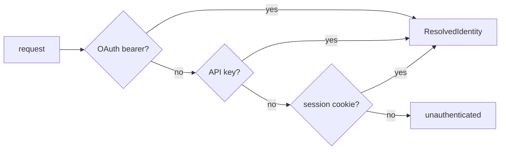
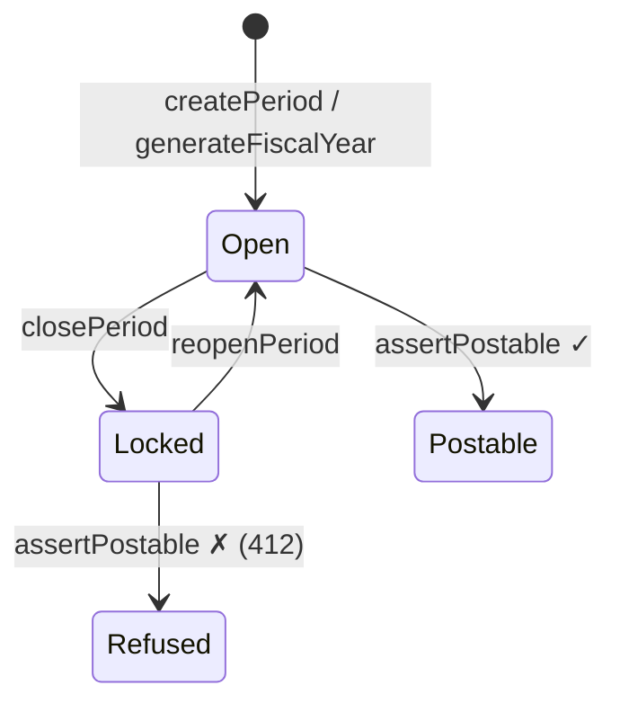
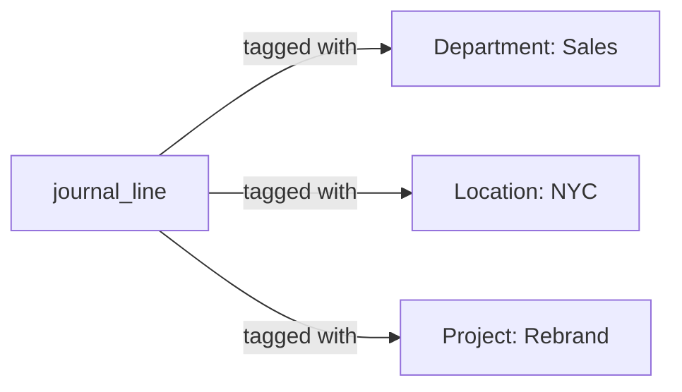

# Foundation

The subsystems every other feature sits on: who the tenant is, who may act, the accounting calendar,
the reporting axes, and the master data (accounts and contacts).

Source: `packages/server/src/modules/{orgs,members,auth,permissions,settings,periods,dimensions,accounts,contacts}`.
Tables: mostly `0001_tenancy` and `0002_ledger`.

---

## Orgs — the tenant root

An **org** is the tenant boundary. `createOrg` creates an org and seeds its Owner membership.
`resolveOrgMembership` is "the single place 'not a member' becomes 'no such org'" — a membership
failure and a nonexistent org must be indistinguishable (acceptance criterion A7).

Orgs also own the **inbound bill-capture mailbox**: `orgs.inbound_email_token` is an unauthenticated
lookup key that routes `POST /v1/bills/inbound/:token` to the right org for OCR capture.

- Files: `orgs.service.ts`, `orgs.repository.ts`, `inbound-email.ts`.

---

## Members & invitations

Two services:

- **`members.service.ts`** — list, re-role, and remove members. Enforces that **an org cannot lose
  its last Owner** via a locking read (`lockOwnerIds`).
- **`invites.service.ts`** — invite-by-email lifecycle (issue, accept, list, revoke). Invite tokens
  are hashed like session tokens. First consumer of the `EmailProvider` seam.

Tables: `org_members`, `org_invites`.

---

## Auth — sessions, org switching, bearer resolvers

Login, register, logout, and `switchActiveOrg`. Three pluggable **identity resolvers** all resolve
to one `ResolvedIdentity` shape and are wired into transport in priority order:

- `password.ts` — Argon2id with tuned cost parameters (an unauthenticated endpoint hashes under
  concurrency).
- `tokens.ts` — a *fast* hash for session/API-key/OAuth-token lookups (the opposite of password
  hashing; reused by the OAuth module).
- `cookie.ts` — the session cookie's lifetime and attributes: `HttpOnly`, server-side, revocable.

Tables: `users`, `sessions`.

---

## Permissions & roles

The authorization catalog and enforcement. Covered in depth in
[API & transport → permissions](../architecture/api-and-transport.md#permissions); the essentials:

- `catalog.ts` — a closed union of **56 permission keys**, kept in lockstep with the seeded
  `permissions` table (set-equality tested).
- `requirePermission` / `hasPermission` — enforcement, **service layer only**.
- `currentPermissions` — the advisory list `GET /v1/auth/me` returns for the UI (authorises nothing).

**Six seeded system roles** (`org_id` NULL = shared across all orgs):

| Role | For |
| --- | --- |
| **owner** | Full authority, including disbursement issue. |
| **bookkeeper** | Day-to-day posting and document entry. |
| **ap_only** | Enter and pay what they owe (bills); can post/reverse/void/pay. |
| **ar_only** | Enter and collect what they're owed (invoices). |
| **read_only / accountant** | Read and report. |
| **approver** | Review agent proposals *and* post them (bundles `agents.review` + `journals.post`). |

Tables: `permissions`, `roles`, `role_permissions`.

---

## Settings — org accounting settings

`org_accounting_settings` holds the org's control-account nominations and reporting preferences:

- The **receivable / payable control accounts** every approved invoice/bill posts against
  (`getControlAccounts`, `resolveControlAccount`).
- The **early-pay discount accounts** cash application posts settlement discounts to.
- The **default reporting basis** — accrual or cash (decision **D-87**).

It's a module of its own (not folded into `orgs` or `accounts`) purely to keep the dependency graph
acyclic: it must be reachable from `accounts`, `invoices`, `bills`, and `payments` without any of
them importing each other. Repointing a control account only affects **future** postings (decision
**D-23**).

---

## Periods — the accounting calendar and the posting gate

`fiscal_periods` is the calendar, and it delivers acceptance criterion **A4**: posting into a locked
period is rejected. The one function the ledger calls is `assertPostable(date)`, which takes a row
lock so a posting racing a period close is atomic (A9).

Non-overlap is enforced in-service (`rangesOverlap`) since MySQL has no exclusion constraints. All
dates are `YYYY-MM-DD` **strings**, never `Date` objects (decisions **D-08, D-17**).

---

## Dimensions — user-defined reporting axes

Instead of QuickBooks' fixed Class + Location pair, an org defines its **own** analysis axes — up to
8 — each with a value list (decision **D-18**). Department, Location, Project, Funding Source:
whatever the business actually reports on.

Tags apply **per journal line**, not per document header — one entry can legitimately split across
axes. `dimensions.service.ts` is axis/value CRUD (archive-not-delete once a value is in use, since the
FK is `RESTRICT`). `tagging.service.ts` owns tag resolution; retagging a posted line is allowed
*even in a closed period*, because a tag is "analysis laid over the ledger," not a term of the entry
(decision **D-32**).

Tables: `dimensions`, `dimension_values`, `journal_line_dimensions` (plus draft/subledger/banking tag
tables).

---

## Accounts — the chart of accounts

CRUD over the ledger's account list, plus a hierarchy (`parent_account_id`, with cycle/depth rules —
the composite FK alone would permit `a→b→a`) and opt-in **starter chart templates**
(`applyChartTemplate`, which writes through the ordinary `createAccount` one row at a time, so there's
no bypass path).

- `normal_balance` is **stored, never derived** — contra accounts are real.
- Account `code` is **immutable** once created (decision **D-27** — it's the keyset sort key).
- Hard delete is allowed only for an account with no postings and no children (`ON DELETE RESTRICT`
  is the real guard).

Tables: `accounts`.

---

## Contacts — customers & vendors

**One table for both roles.** `is_customer` / `is_vendor` flags, neither required (an employee
reimbursement names a contact that is neither). Unlike accounts, a contact's `code` is *mutable*
(contacts are addressed by row id in postings, not by code), and hard delete is allowed only when
nothing in the ledger names the contact. A deactivated contact can't be posted to on a new entry
(reversals exempted).

Contacts also carry `default_payment_term_id` and vendor-disbursement fields used by cash application
and pay-bills.

Tables: `contacts`.

---

## Related reading

- [Ledger kernel](../architecture/ledger-kernel.md) — what accounts and periods feed.
- [Sales / AR](sales-ar.md) and [Purchases / AP](purchases-ap.md) — the documents built on this master data.
- [API & transport → permissions](../architecture/api-and-transport.md#permissions) — the full permission model.
