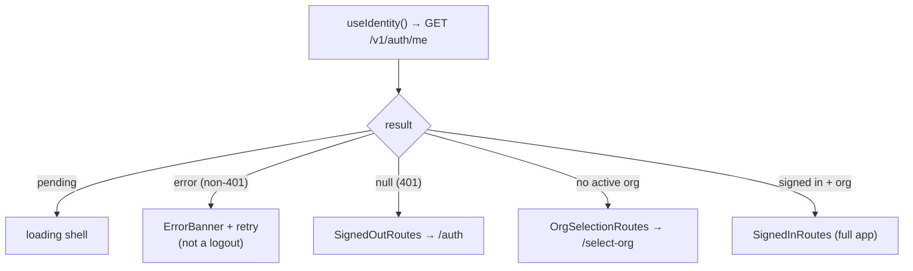
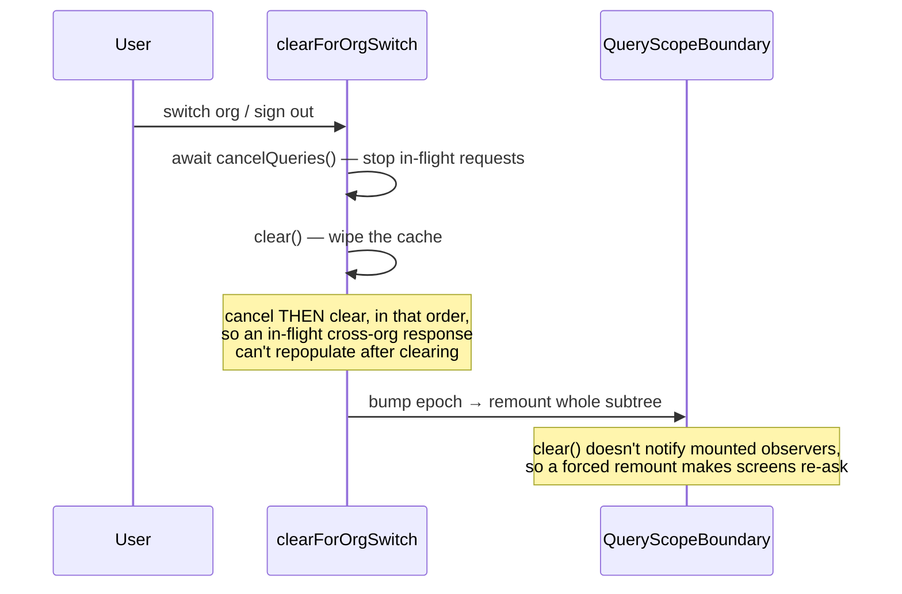
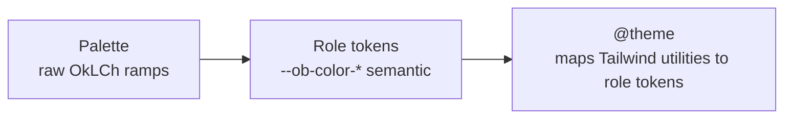

# Frontend (the React SPA)

The web app is a **pure client of the public REST API** — it has no privileged path. If a screen can
do something, an integrator can do the same thing through the same endpoint. This page covers how the
SPA is structured, the security-critical patterns it implements, and its design system.

Source: `packages/web/src/`.

---

## Structure at a glance

```
src/
  main.tsx          entry — one QueryClient, ThemeProvider, single stylesheet
  App.tsx           BrowserRouter + the auth guard + route table
  api/              the typed OpenAPI client + error presentation
  query/            TanStack Query setup + the org-switch cache-clear
  auth/             identity, org selection, switch, sign-out
  shell/            AppShell layout, nav, query-scope boundary
  screens/          one folder per feature area
  components/       small Radix-based UI kit
  money/            cents-string formatting (mirrors the server)
  theme/ styles/    the design-token system
  lib/              cx(), the thin fetch client
  test/             Vitest + testing-library setup
```

- `main.tsx` creates **one `QueryClient` at module scope** (a re-render can't replace the cache) and
  imports the single stylesheet.
- `App.tsx` uses `<BrowserRouter>` with **no data router** — a loader would be a second data-fetching
  path outside TanStack Query's cache, which the org-switch cache-clear depends on being exhaustive.

---

## Routing and the auth guard

`AppRoutes` is the guard, driven by `useIdentity()` (`GET /v1/auth/me`):



Returning `null` (a value, not a thrown error) for a 401 is what lets the guard distinguish "signed
out" from "the identity call itself failed" (a 503 shows a retry button, not a login form).

### The route table

`/accounts`, `/journal-entry`, `/contacts`, `/sales`, `/recurring-invoices`, `/dunning`,
`/purchases`, `/bill-captures`, `/money`, `/banking/*`, `/processing`, `/reports`, `/settings`,
`/quickbooks-import`, `/api-keys`, `/oauth-clients`, `/connected-apps`, `/agent-proposals`,
`/oauth/consent`, and the public `/i/:token`.

> **Design invariant (D-25): every screen is mounted unconditionally.** Permissions filter _nav
> visibility only_ — routes are never permission-gated, because enforcement is server-side. Typing a
> URL for a screen you lack permission for renders the screen, which then gets refused by the API.
> `App.test.tsx` asserts exactly this: a caller without `reports.read` gets no Reports nav link but
> can still navigate to `/reports` with no redirect.

Banking is its own **nested** router (`/banking/*` with relative sub-paths `accounts`, `import`,
`match`, `reconcile`) — a deliberate local exception, called out in comments as not-to-generalise.

---

## The screens

| Route                 | Screen                                                                                          |
| --------------------- | ----------------------------------------------------------------------------------------------- |
| `/auth`               | Sign-in / register (session cookie, no token handling).                                         |
| `/select-org`         | Pick a membership or create an org.                                                             |
| `/accounts`           | Chart of accounts — tree/table, create/edit/deactivate, chart templates.                        |
| `/journal-entry`      | Manual double-entry editor — draft vs posted, balance indicator, one idempotency key per draft. |
| `/contacts`           | Customers/vendors directory; deactivate vs delete by posting history.                           |
| `/sales`              | Invoices & credit notes — editor/list/view, line items, allocations, sending.                   |
| `/recurring-invoices` | Recurring templates the scheduler materialises.                                                 |
| `/dunning`            | Overdue-reminder policies & ladders (no "send now").                                            |
| `/purchases`          | Bills & vendor credits (two tabs).                                                              |
| `/bill-captures`      | OCR capture review queue → draft bills.                                                         |
| `/money`              | Payments in/out + allocations, plus AR/AP aging.                                                |
| `/banking/*`          | Accounts → import → match → reconcile workflow.                                                 |
| `/processing`         | Connect a payment processor (write-only secrets).                                               |
| `/reports`            | TB, P&L, BS, GL, cash-flow — shared filter/date/dimension controls, drill-through.              |
| `/settings`           | Fiscal periods, dimensions, members/roles, branding, payment terms, discount accounts.          |
| `/quickbooks-import`  | QuickBooks migration preview + import.                                                          |
| `/api-keys`           | Issue/revoke role-bound API keys (secret shown once).                                           |
| `/oauth-clients`      | Register/deactivate third-party OAuth clients (admin).                                          |
| `/connected-apps`     | The user's own granted apps (revoke own tokens).                                                |
| `/agent-proposals`    | Human review queue for AI-authored journal drafts.                                              |
| `/oauth/consent`      | OAuth 2.1 consent (reached only via the server's redirect).                                     |
| `/i/:token`           | Public hosted-invoice view — no session, no cache, no AppShell.                                 |

---

## The org-switch cache-clear (security-critical)

When a user switches org or signs out, **all cached data must go** — or one org's data could render
under another's scope.



This is deliberately **wholesale** (not per-key org scoping — a forgotten `queryKey` would silently
leak) and always paired with a `QueryScopeBoundary` remount. It's the single reason `App.tsx` avoids a
data router.

---

## API client & data fetching

- **`api/client.ts`** wraps `openapi-fetch` with `credentials: 'include'` and a middleware that
  **throws if a write reaches the network without an `idempotency-key`** (a backstop; the primary
  enforcement is type-level — every write's OpenAPI schema declares the header `required`, so the call
  site fails to compile without it).
- **`api/schema.d.ts`** is generated from the repo-root `openapi.json`; drift is gated (see
  [drift](../architecture/api-and-transport.md#drift-is-a-build-failure)).
- **`api/presentation.ts`** maps every server error `code` to `{ title, message, recovery }`. Notably
  `permission_denied` and `not_found` share identical wording (the A7 rule).
- **`query/`** — TanStack Query with `staleTime: 30s`, `refetchOnWindowFocus: false` (accounting data
  changes on _this_ user's own posts, which invalidate explicitly). Mutations default to `retry: 0`
  (retrying is only safe when variables carry the idempotency key). Per-screen `queries.ts` files own
  their own keys and `invalidateQueries({ queryKey: SCOPE })` on success.

Session auth is an `HttpOnly; SameSite=Lax` cookie — the SPA never reads, stores, or attaches a
token; the browser carries it because the client sets `credentials: 'include'`, and same-origin (dev
proxy / prod nginx) is what makes that work without CORS.

---

## Money on the client

`money/format.ts` mirrors the server's minor-units rule with its **own** implementation (not imported
from `shared-types`): regex-validate the canonical integer string, slice to format (never
`Number(x)/100`), throw on excess precision. The only component allowed to do the conversion is
`<MoneyInput>`. See [Money & invariants](../architecture/money-and-invariants.md).

---

## Design tokens & theming

`styles/tokens.css` is a three-layer token system (decision **D-24**):



- Tailwind's default theme is **wiped** (`--*: initial`), so a class like `bg-red-500` produces _no
  CSS at all_ — "tokens only" is mechanically enforced, not review-dependent.
- The `openbooks/no-raw-color` lint rule bans hex/rgb/oklch literals in `.tsx`; `tokens.css` is the
  only file allowed to name a raw colour.
- Theme is driven by a `data-theme` attribute on `<html>` (an inline pre-paint script resolves it from
  `localStorage`/system preference to avoid a flash); `dark:` keys off `[data-theme='dark']`, not the
  media query.
- Dedicated `--ob-color-amount-positive` / `-negative` tokens exist separately from success/danger —
  a negative balance isn't an "error."

The component kit (`components/`) is deliberately small, built on Radix primitives (Button, Combobox,
Dialog, Field/TextInput, MoneyInput, Popover, Select). See
[Development → conventions](../guides/development.md).

---

## Testing & build

- **Tests** — Vitest + jsdom + testing-library, colocated `*.test.tsx`. API calls are stubbed by
  replacing `globalThis.fetch` at import time (openapi-fetch captures `fetch` when the singleton is
  built). `App.test.tsx` covers the route guard exhaustively.
- **Dev** — Vite on `:5173`, proxying `/v1`, `/health`, `/public`, `/artifacts`, `/oauth`, `/mcp` to
  `OPENBOOKS_API_TARGET` (default `:3100`). Every proxy rule exists because an unproxied path in dev
  returns Vite's SPA fallback (`index.html` + 200), turning a missing rule into an opaque JSON-parse
  error instead of a clear 404.
- **Production** — `vite build` → static files served by **nginx** (`infra/nginx/openbooks-web.conf`),
  which reverse-proxies the API paths same-origin. The server image does **not** ship the web bundle.

See [Getting started](../guides/getting-started.md) and [Deployment](../guides/deployment.md).

---

## Related reading

- [API & transport](../architecture/api-and-transport.md) — the API this SPA consumes.
- [Money & invariants](../architecture/money-and-invariants.md) — the money rule the client mirrors.
- [Platform & AI](platform-and-ai.md) — the OAuth/agent screens' backends.
