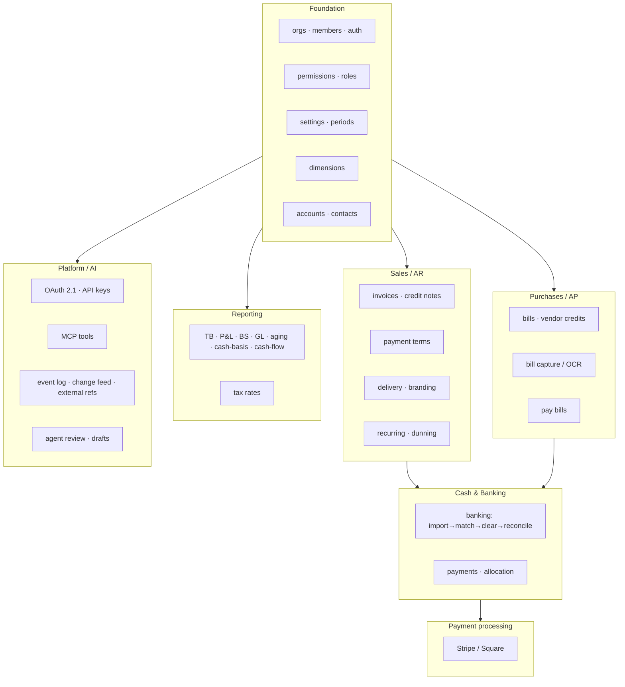

# Features Overview

This section documents **what each subsystem does** — the business capabilities built on top of the
[ledger kernel](../architecture/ledger-kernel.md). Every subsystem is a module under
`packages/server/src/modules/`, owns a set of tables (from a numbered migration), and posts to the
ledger only through the sanctioned posting/allocation services.

---

## The feature map

---

## Build status

| Area                         | Status     | Notes                                                                                                                                                  |
| ---------------------------- | ---------- | ------------------------------------------------------------------------------------------------------------------------------------------------------ |
| **Foundation** (M1–M2)       | ✅ Built   | Tenancy, auth, ledger kernel, CoA, contacts, dimensions, periods, settings.                                                                            |
| **Sales / AR** (M3 + INV)    | ✅ Built   | Invoices, credit notes, payment terms, PDF/hosted-page/email delivery, recurring & dunning, customer statements of account.                            |
| **Purchases / AP** (M3 + O)  | ✅ Built   | Bills, vendor credits, OCR capture, **Pay Bills** disbursements (queue → issue with SoD, check output), and procure-to-pay (POs, estimates, expenses). |
| **Cash & Banking** (M4 + CA) | ✅ Built   | Statement import, matching, clearing, reconciliation, cash application, settlement discounts.                                                          |
| **Payment processing** (PAY) | ✅ Built   | Stripe/Square as clearing account; real adapters proven in manual sandbox, `fake` drives the gate.                                                     |
| **Reporting & tax** (M2 + K) | ✅ Built   | All core statements incl. cash-basis and cash flow; CSV/Excel report export.                                                                           |
| **Platform / AI** (M5)       | ✅ Built   | OAuth 2.1 AS, API keys, MCP, event outbox, change feed, external refs, agent review.                                                                   |
| **Automations** (M6)         | ✅ Built   | MCP-polled agent work queue — the org's own agent leases queued work and submits proposals into the review queue; OpenBooks makes no inference call.   |
| **Launch polish** (M7)       | 🔲 Partial | QuickBooks CSV import and CSV/Excel report export done; onboarding, document-list export, and the published spec remain.                               |

---

## Subsystem → migration → doc

| Subsystem                                                                 | Migration                 | Documented in                                                                                       |
| ------------------------------------------------------------------------- | ------------------------- | --------------------------------------------------------------------------------------------------- |
| orgs, members, auth, permissions, roles, api-keys, sessions               | `0001_tenancy`            | [foundation](foundation.md), [platform-and-ai](platform-and-ai.md)                                  |
| accounts, contacts, dimensions, periods, drafts                           | `0002_ledger`             | [foundation](foundation.md)                                                                         |
| idempotency keys                                                          | `0003_idempotency`        | [Money & invariants](../architecture/money-and-invariants.md)                                       |
| invoices, bills, payments, allocations, tax, settings, document sequences | `0005_subledger`          | [sales-ar](sales-ar.md), [purchases-ap](purchases-ap.md), [reporting-and-tax](reporting-and-tax.md) |
| banking: import, matching, rules, clearing, reconciliation                | `0006_banking`            | [banking-and-cash](banking-and-cash.md)                                                             |
| invoice delivery, org branding                                            | `0007_invoice_delivery`   | [sales-ar](sales-ar.md)                                                                             |
| recurring invoices, dunning                                               | `0008_recurring_dunning`  | [sales-ar](sales-ar.md)                                                                             |
| bill capture (OCR)                                                        | `0009_bill_capture`       | [purchases-ap](purchases-ap.md)                                                                     |
| OAuth, event log, change feed, external refs                              | `0010_platform`           | [platform-and-ai](platform-and-ai.md)                                                               |
| payment processing (Stripe/Square), secrets                               | `0011_payment_processing` | [payments-processing](payments-processing.md)                                                       |
| payment terms, cash application                                           | `0012_cash_application`   | [sales-ar](sales-ar.md), [banking-and-cash](banking-and-cash.md)                                    |
| pay bills, cheque sequences                                               | `0013_pay_bills`          | [purchases-ap](purchases-ap.md)                                                                     |
| fixed assets & recurring journals (L)                                     | `0014_fixed_assets`       | [ROADMAP](../../ROADMAP.md)                                                                         |
| procure-to-pay: purchase orders, estimates, expenses (M)                  | `0015_procure_to_pay`     | [purchases-ap](purchases-ap.md)                                                                     |
| budgets (N)                                                               | `0016_budgets`            | [reporting-and-tax](reporting-and-tax.md)                                                           |
| accountant close: period sign-off, statement packages, audit (P)          | `0017_accountant_close`   | [foundation](foundation.md)                                                                         |
| automations / agent work queue (M6, Q)                                    | `0018_automations`        | [platform-and-ai](platform-and-ai.md)                                                               |
| item catalog (CAT)                                                        | `0019_catalog`            | [sales-ar](sales-ar.md), [purchases-ap](purchases-ap.md)                                            |
| contact addresses                                                         | `0020_contact_address`    | [foundation](foundation.md)                                                                         |
| live bank feeds (Stripe Financial Connections)                            | `0021_bank_feeds`         | [banking-and-cash](banking-and-cash.md)                                                             |
| customer statements of account                                            | `0022_account_statements` | [sales-ar](sales-ar.md)                                                                             |
| app grants (always last)                                                  | `0999_app_grants`         | [Data & tenancy](../architecture/data-and-tenancy.md)                                               |

---

## A few product principles that recur

- **No stored balances or statuses.** Outstanding = total − allocations; status is derived from
  journal ids. Every figure is recomputed live (decisions **D-34**, **D-38**).
- **Proposals never post.** Bank matching, bank rules, and discount suggestions _propose_; only a
  human-accepted action writes to the ledger (decision **D-43**).
- **Corrections are reversals, deletes are rare.** Documents void by posting a reversing journal;
  hard delete is allowed only when nothing in the ledger references the row.
- **One primitive, reused.** The early-pay discount posting shape is shared between bank clearing and
  (future) Pay Bills so the two can't drift (decision **D-112**); dimensions replace QBO's fixed
  Class+Location with an arbitrary user-defined set (decision **D-18**).

Read the area docs for the detail:
[Foundation](foundation.md) ·
[Sales / AR](sales-ar.md) ·
[Purchases / AP](purchases-ap.md) ·
[Cash & Banking](banking-and-cash.md) ·
[Payments processing](payments-processing.md) ·
[Reporting & tax](reporting-and-tax.md) ·
[Platform & AI](platform-and-ai.md) ·
[Frontend](frontend.md).
