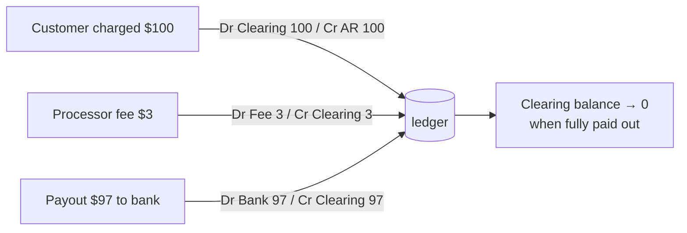
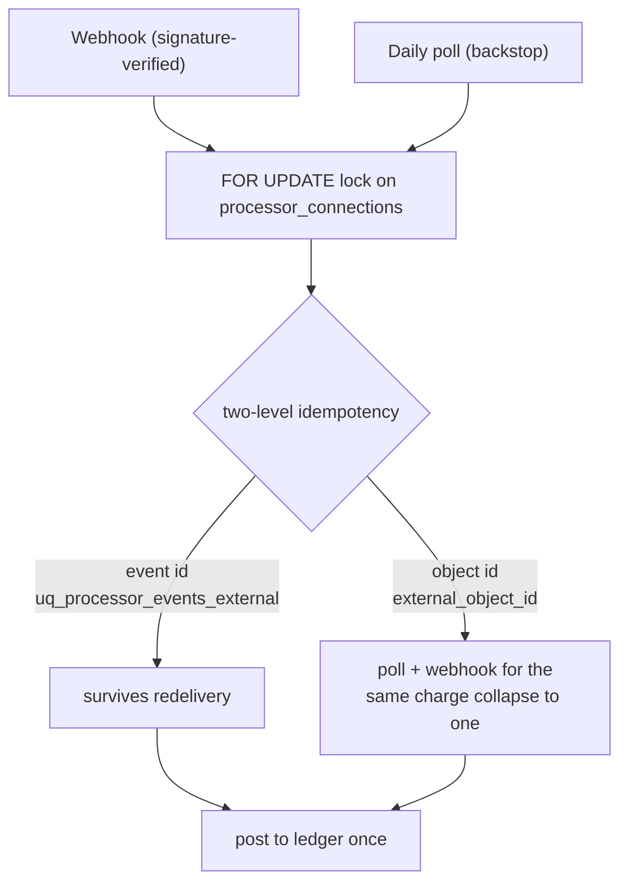

# Payment Processing (Stripe / Square)

Take card payments through the org's *own* Stripe or Square account, and have every charge, fee,
refund, and payout land in the ledger automatically. The model reuses one idea from banking: **a
processor is a clearing account.**

Source: `packages/server/src/modules/payments-processing`.
Tables: `0011_payment_processing` (`processor_connections`, `processor_events`, `secrets`).

---

## The clearing-account model

When a customer pays a `$100` invoice by card, the money doesn't arrive in the bank instantly — it
sits with the processor, minus a fee, until a payout. OpenBooks models exactly that:

Connecting a processor nominates **two existing ledger accounts** (decisions **D-82, D-104**):

- a **clearing account** — a charge debits AR and credits clearing immediately (just as a bank
  account is "a ledger account plus import metadata");
- a **fee account** — the per-charge processor fee (decision **D-84**).

The clearing account's ledger balance should trend to zero as payouts settle; the daily poll
reconciles it against the processor's own reported balance.

Files: `connections.service.ts`, `posting.service.ts`.

---

## Credentials never stored inline

Processor API keys and webhook secrets are **not** columns on `processor_connections`. They're
`secret_ref` / `webhook_secret_ref` pointers into a dedicated **`secrets` table** (AES-256-GCM at
rest under the `local` provider, AWS Secrets Manager when hosted — decision **D-101**). That table is
deliberately *not* tenant-scoped (it's infrastructure). The management API is **write-only** — a
stored secret is never read back to a client. See
[Providers & config](../architecture/providers-and-config.md) and
[Security](../architecture/security.md#secrets-at-rest).

---

## Two ways events arrive, two levels of idempotency

A charge can be reported twice — once by a webhook, once by the daily poll. Both collapse to one
ledger effect:

- **Event-level** — `uq_processor_events_external` on `(org_id, processor, external_event_id)` survives
  webhook redelivery.
- **Object-level** — `external_object_id` correlation, so a poll and a webhook reporting the same
  charge don't double-post.
- The webhook signature is verified before anything, under a `processor_connections` `FOR UPDATE`
  lock.

Files: `webhook.service.ts`, `poll.job.ts`.

---

## What's handled

| Event | Ledger effect |
| --- | --- |
| **Charge** | Dr clearing / Cr AR (settles the receivable). |
| **Fee** | Dr fee account / Cr clearing. |
| **Refund** | Reopens the receivable (Dr AR / Cr clearing) — full credit-note flow deferred. |
| **Chargeback** (lean) | Loss currently codes to the fee account (a dedicated loss account is a follow-up). |
| **Payout** | Dr bank / Cr clearing, reconciled via banking's `link_entry`. |

The daily **poll** (`poll.job.ts`, decision **D-85**) is the backstop: it redrives missed events and
reconciles the clearing account's ledger balance against the processor's reported balance (reusing
banking's `bookBalance`).

The public surface: `/v1/processing` management routes, a public pay-link, and a **Pay** button on
the hosted invoice page.

---

## Adapters

`PaymentProcessorProvider` has three adapters (decision **D-102**):

- **`fake`** — a real, deterministic adapter that drives the hermetic test gate.
- **`stripe`**, **`square`** — real adapters, proven in a **manual sandbox** run (the gate runs the
  `fake`).

See [Providers & config](../architecture/providers-and-config.md).

---

## Known lean-v1 edges

Flagged honestly in the roadmap; not correctness bugs today:

- Real Stripe/Square are proven only in a manual sandbox (the gate runs `fake`).
- The poll passes `last_polled_at` (a timestamp) as the processor cursor — the `fake` ignores it, but
  real Stripe reads a cursor as an event id; a dedicated cursor column is the fix for live polling.
- Chargeback losses code to the fee account (dedicated loss account deferred).
- A refund reopens the receivable rather than issuing a full credit note.
- Currency is hard-coded `usd` (multi-currency, spec §13, is out of v1).
- Square's webhook signature falls back to `appBaseUrl` for the notification-URL component (a real
  webhook-URL field is a production follow-up).

---

## Related reading

- [Banking & cash](banking-and-cash.md) — the clearing-account idea this reuses.
- [Sales / AR](sales-ar.md) — the invoices these charges settle.
- [Security](../architecture/security.md) — secrets and the owed reviews.
