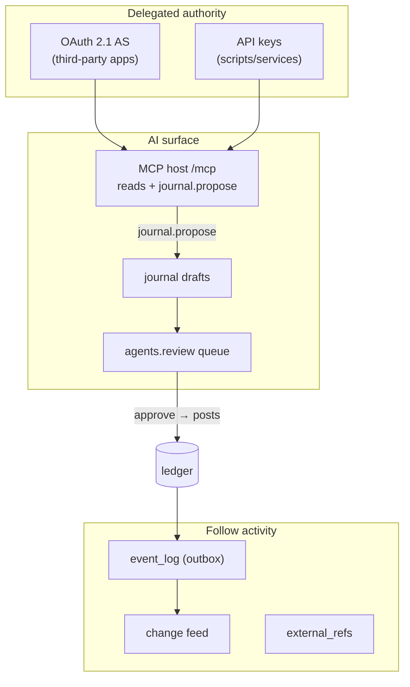
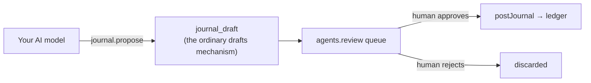
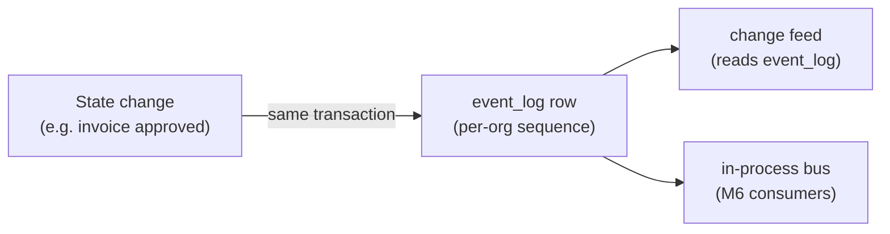

# Platform & AI

The integration surface: how third parties and AI models act on an OpenBooks ledger with scoped,
revocable authority, how they follow activity, and how AI proposals reach the ledger only through a
human.

Source: `packages/server/src/modules/{oauth,api-keys,mcp,events,change-feed,external-refs,agents,drafts,scheduling}`.
Tables: `0001_tenancy`, `0010_platform`, `0002_ledger`.

---

## The platform at a glance

---

## OAuth 2.1 authorization server

`oauth.service.ts` implements a full AS in-house (no third-party AS dependency):

- **Client registration** — admin-only; no public dynamic registration in v1.
- **Authorization-code grant with mandatory PKCE** — `oauth_grants` are short-lived and single-use.
- **Token issue / refresh / revoke** — `oauth_tokens` are **opaque** (not JWT) and hashed like API
  keys.
- **Consent tracking** — `oauth_consents`, overwritten (not accumulated) on re-consent.

The defining property: **effective scope is recomputed live against the user's current role on every
request** (decision **D-54**) — never trusted from what the token carries. So a role change or
revocation takes effect immediately, without touching a token row. See
[API & transport → OAuth scope narrowing](../architecture/api-and-transport.md#oauth-scope-narrowing).

Tables: `oauth_clients`, `oauth_grants`, `oauth_tokens`, `oauth_consents`.

> The AS was built to spec in-house; an **external security review (OB-098) is owed before
> production**. See [Security](../architecture/security.md#reviews-owed-before-production).

---

## API keys

For scripts and services with "no person behind it." Issue / list / revoke; each key carries its
**own `role_id`** (not the issuer's), so a later-demoted issuer's key doesn't retain old authority
(decision **D-55**). Opaque `key_prefix` + SHA-256 `key_hash`, same shape as sessions and OAuth
tokens. The full secret is shown **once**, at creation.

Tables: `api_keys`.

---

## MCP — the AI tool surface

`host.ts` is a minimal, dependency-free, in-process **JSON-RPC-2.0-over-HTTP** MCP host (`initialize`,
`tools/list`, `tools/call`) mounted at `POST /mcp` on the *same* Fastify instance as REST — no
`@modelcontextprotocol/*` SDK dependency, by deliberate choice.

`tools.ts` defines a focused suite where **every handler is a thin call onto an existing service** —
same input schema, same `requirePermission` — as the equivalent REST route:

| Tool | Kind |
| --- | --- |
| `accounts.list` | read |
| `contacts.list` | read |
| `bills.list` | read |
| `invoices.list` | read |
| `trial-balance` | read |
| `journal.propose` | **write — but lands a draft, never a journal** |

There is **no execute path for a ledger-writing tool at all** (decisions **D-59, D-60**). The one
write tool lands a draft that a human with `agents.review` turns into a posting.

---

## Agents — the review queue

`review.service.ts` is the queue of pending journal drafts an autonomous agent produced, gated on
`agents.review`. **Approving a proposal actually posts it**, so a reviewer also needs `journals.post`
— which is why the seeded `approver` role bundles both.

---

## Drafts

The mutable, non-financial staging area for a journal entry (`journal_drafts`): editable and
discardable freely, in no report, no trial balance, no invariant — because it "has not happened yet"
(decisions **D-16, D-19**). It carries no sequence number (would leave a gap on discard, decision
**D-14**) and no period (resolved from `entry_date` only at post time). `postDraft` runs `postJournal`
and deletes the draft in one transaction. The same mechanism backs the AI `journal.propose` tool.

Tables: `journal_drafts`, `journal_draft_lines`, `journal_draft_line_dimensions`.

---

## Events — the transactional outbox

`outbox.ts::emitEvent` writes one `event_log` row per committed domain event, **in the same
transaction** as the state change it describes, numbered by a per-org `FOR UPDATE` counter
(`event_positions`) exactly like `journal_sequences` (decision **D-56**).

This guarantees an event exists **iff** its change committed, and gives per-org events a total order.
`bus.ts::InProcessEventBus` is a separate in-process notification mechanism for future M6 consumers —
not what the change feed reads. Tables: `event_log` (append-only), `event_positions`.

---

## Change feed

`change-feed.service.ts::readChangeFeed` is a keyset-paginated, tenant-scoped, **resumable** read
directly over `event_log` — "a projection, not a second store" (decision **D-57**).
`change_feed_cursors` holds only where each named subscriber last stopped; replay is just not
advancing (or rewinding) the cursor. A retention bound is documented; no pruning job yet. Tables:
`change_feed_cursors`.

---

## External refs — integrator correlation

`external-refs.service.ts` maintains a bidirectional, uniquely-keyed map from an integrator's own id
to an OpenBooks entity (decision **D-58**) — "generalised idempotency for *relationships*" (versus
`Idempotency-Key` for one-shot requests). `entity_id` is deliberately **not** a foreign key (only the
owning entity's service can validate it; this is a correlation record, not a referential guarantee).
Used by QuickBooks import and payment processing. Tables: `external_refs`.

---

## Scheduling — the automation runtime

The runtime the AR/AP automations run on:

- `automation.ts::runAsAutomation` — runs a callback under a system/automation actor context (used by
  recurring invoices, dunning, QuickBooks opening-balance posting, processor polling).
- `tick.ts::registerDailyTask` / `startDailyTick` — the daily cron fan-out every automation
  subsystem registers into.
- `trigger.ts::runDueWorkNow` — forces an immediate run for testing/ops
  (`POST /v1/scheduling/run-due-work`).

Under `QUEUE_PROVIDER=in-process` the `api` role runs the tick; under `sqs` the `worker` role does.
See [Providers & config](../architecture/providers-and-config.md#entry-points).

---

## Imports — one-time migration

`imports/quickbooks/` is a one-shot CSV importer: `previewQuickBooksImport` (dry run, writes nothing)
and `importQuickBooks` (one all-or-nothing transaction). It creates accounts and contacts by looping
through the **ordinary** `createAccount`/`createContact` service calls — never a bulk insert — so a
QuickBooks-sourced row is validated by exactly the same code path as a hand-typed one, then posts the
opening trial balance as one journal. Structured as a directory so a second source (Xero, hand-built
CSV) can be added as a sibling. Owns no tables of its own.

---

## Related reading

- [Security](../architecture/security.md) — the full authentication/authorization posture.
- [API & transport](../architecture/api-and-transport.md) — permissions, scope narrowing, the MCP mount.
- [Frontend](frontend.md) — the OAuth consent, connected-apps, and agent-proposals screens.
