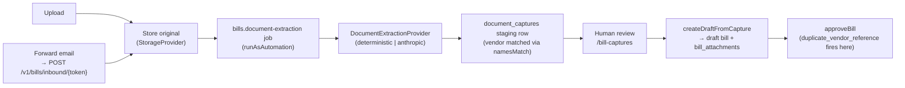
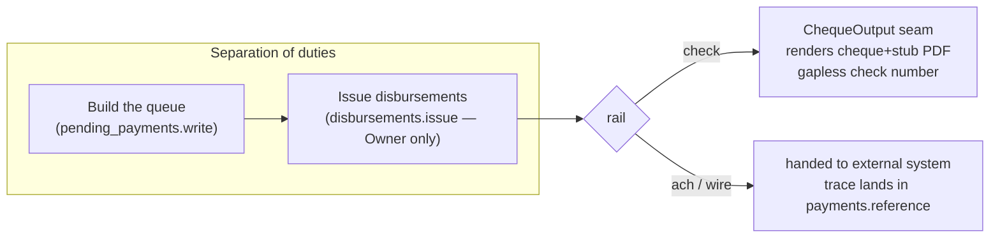

# Purchases / Accounts Payable

Money owed *by* the business: bills and vendor credits, the OCR pipeline that turns a photographed or
emailed bill into a draft, and the disbursement side that pays them.

Source: `packages/server/src/modules/{bills,pay-bills}`.
Tables: `0005_subledger`, `0009_bill_capture`, `0013_pay_bills`.

---

## Bills & vendor credits

Structurally a mirror of [invoices](sales-ar.md#invoices--credit-notes): an **AP document** is a bill
or a vendor credit, with the same `draft → approved → void` lifecycle, no stored balance/status, and
posting through `postJournal` / `reverseJournal`.

Two AP-specific rules matter:

1. **Duplicate-reference refusal.** A bill's `reference` is the *vendor's own* invoice number. A
   duplicate reference from the same vendor is refused (`assertNoDuplicateReference`) — this is the
   classic double-payment mistake, caught at entry.
2. **Inverted journal direction.** A bill **credits** AP and debits expense; an invoice **debits** AR.
   Getting this backwards still balances the trial balance but poisons the balance sheet — so the
   direction (`journalSides`) is explicit, not inferred.

An approved bill posts to the org's nominated **payables control account**.

Files: `bills.service.ts`, `vendor-credits.service.ts`.
Tables: `ap_documents`, `ap_document_lines`, `ap_document_line_dimensions`.

---

## Bill capture (OCR)

Upload a bill, or forward it to your org's inbound mailbox, and it becomes a **draft bill** for a
human to review.

- **Two provider seams**, each with a self-host default and a deferred hosted adapter (see
  [Providers](../architecture/providers-and-config.md)): extraction (`deterministic` real parser /
  `anthropic` placeholder) and inbound mail (`dev` JSON webhook / `ses-inbound`).
- A per-org `orgs.inbound_email_token` routes forwarded mail to the right org.
- Capture reuses the `bills.read`/`bills.write` permissions — **no new catalog keys** — and the final
  approval runs the *same* `approveBill` path a hand-entered bill does, so the duplicate-reference
  guard still applies.

Files: `capture/capture.service.ts`, `capture/extraction.job.ts`.
Tables: `document_captures`, `bill_attachments`.

---

## Pay Bills — disbursements

> **⚠️ Status: partial.** The cheque-printing plumbing and the schema/permissions exist. The
> pending-payment queue service that ties them together **is not yet written** — there is no
> `pending-payments.service.ts`. Treat this section as "the shape that's coming," and check the code
> before relying on it.

The design (decisions **D-109…D-112**):

- **Rails are classification tags, not adapters** (decision **D-110**): `check` is executed in-app;
  `ach`/`wire` are handed to an external system and OpenBooks just records the trace. There is no
  NACHA/wire logic — external systems execute.
- **Cheque is the only internal rail**, behind a swappable `ChequeOutput` seam (a company that prints
  externally swaps it). Cheque numbers are gapless per bank account
  (`check-register.repository.ts::allocateCheckNumber`, the `document_sequences` twin, decision
  **D-111**).
- **Separation of duties** is real: building the payment queue and issuing it are different
  permissions (`pending_payments.write` vs `disbursements.issue`, the latter seeded to Owner only,
  decision **D-109**).
- The settlement discount **reuses the cash-application primitive** (decision **D-112**) so AP and AR
  discounts can't drift.

What exists in code today: `check-register.repository.ts` (gapless cheque numbers) and
`check-output.ts` (cheque+stub PDF via pdfmake, retained via `StorageProvider`, swappable via
`setCheckOutput`). Tables: `pending_payments`, `pending_payment_intents`, `check_number_sequences`.

---

## Related reading

- [Foundation](foundation.md) — vendors (contacts), control accounts.
- [Banking & cash](banking-and-cash.md) — the `payments`/`postSettlementDiscount` primitives Pay Bills reuses.
- [Reporting & tax](reporting-and-tax.md) — AP aging.
