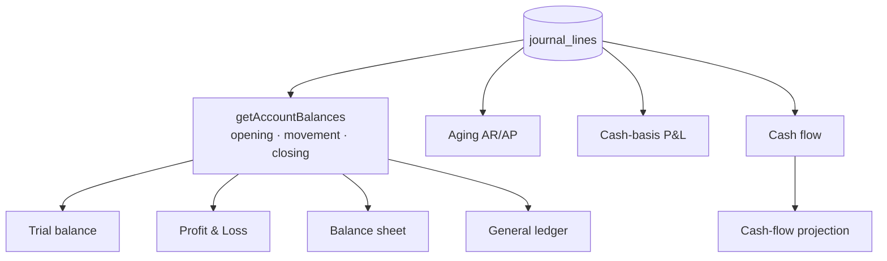

# Reporting & Tax

Every financial figure is computed **live from `journal_lines`** — there is no balance cache anywhere
(spec §2.6). This page covers the report suite and the tax-rate subsystem.

Source: `packages/server/src/modules/{reports,tax}` (and `getTrialBalance` in `modules/ledger`).
Tables: `0005_subledger` (`tax_rates`); reports own no tables.

---

## One aggregation, many projections

`balances.service.ts::getAccountBalances` is the shared core: opening / movement / closing over a
date range, per account, optionally grouped by one dimension (with a mandatory "unassigned" bucket,
criterion B6). Every other report is a thin projection of it.

| Report                                                       | What it reads                                                               | Notes                                                                                                                                                                                        |
| ------------------------------------------------------------ | --------------------------------------------------------------------------- | -------------------------------------------------------------------------------------------------------------------------------------------------------------------------------------------- |
| **Trial balance** (`getTrialBalance`, in `modules/ledger`)   | all accounts                                                                | The **oracle** every property test checks against.                                                                                                                                           |
| **Profit & Loss** (`profit-and-loss.service.ts`)             | `movement` for revenue/expense over a period                                |                                                                                                                                                                                              |
| **Balance sheet** (`balance-sheet.service.ts`)               | `closing`, plus current-year earnings derived from revenue/expense movement | No year-end closing journal exists (decision **D-20**).                                                                                                                                      |
| **General ledger** (`general-ledger.service.ts`)             | per-account drill-down                                                      | Running balance across keyset pages.                                                                                                                                                         |
| **Aging** (`aging.service.ts`)                               | AR/AP outstanding as-at a date                                              | Bucket sums tie **exactly** to the control-account balance (decision **D-40**, criterion C8); includes unapplied credits as a negative "current" line; doubles as the per-contact statement. |
| **Cash-basis P&L** (`cash-basis/`)                           | recognises revenue/expense only when cash moved                             | Drop-in alternate aggregator; flags ambiguous cases for review rather than guessing (decisions **D-87, D-99**).                                                                              |
| **Cash flow** (`cash-flow.service.ts`)                       | indirect method                                                             | One honest reconciling "plug" rather than a fabricated operating/investing/financing split (decision **D-88**).                                                                              |
| **Cash-flow projection** (`cash-flow-projection.service.ts`) | forward-looking off AR/AP due dates                                         | Overdue amounts land in the earliest bucket.                                                                                                                                                 |

**No balance caching anywhere** — every figure recomputes live. That's what makes the trial balance a
trustworthy oracle and lets property tests generate random journals and check invariants against it.

### Accrual vs cash basis

The org's `default_reporting_basis` (in [settings](foundation.md#settings--org-accounting-settings))
chooses which aggregator the P&L uses. Cash basis (decision **D-87**) supersedes the earlier
accrual-only scope, because most small businesses file cash-basis.

> A cash-basis edge once caught a real transport defect: `basis` never crossed the wire schema, so
> the API silently reported accrual. The fix and the E2E that caught it are recorded in the roadmap —
> a good illustration of why the [drift gate](../architecture/api-and-transport.md#drift-is-a-build-failure)
> and browser narratives exist.

---

## Reporting dimensions

Any report backed by `getAccountBalances` can be **sliced by one dimension** — grouping account
balances by Department, Location, Project, etc., with a guaranteed "unassigned" bucket so totals
always reconcile. See [dimensions](foundation.md#dimensions--user-defined-reporting-axes).

---

## Tax

`tax-rates.service.ts` is CRUD/lifecycle over a per-org rate list. A rate has:

- a **name**;
- a **percentage** stored as integer parts-per-million (`rate_ppm`, _not_ `DECIMAL`) so it survives
  the driver round-trip as a `bigint` rather than a float-prone string;
- the **liability _or_ asset account** it posts to (the asset side supports reclaimable input VAT);
- `applies_to` — sales / purchases / both (enforced where a document line cites the rate, not here).

Rules:

- The percentage is **immutable** once created. Correcting a rate is a _new_ rate plus archiving the
  old one — a changed rate would restate already-posted, already-mailed invoices.
- **Zero-rated** (`rate = 0`, an explicit row) and **exempt** (`tax_rate_id IS NULL`) are deliberately
  different and never collapsed.

Tax computation itself (two rounding points per line, decision **D-35**) lives in
`shared-types/tax/compute.ts` and is reused by invoices and bills — never reimplemented.

Tables: `tax_rates`.

---

## Related reading

- [Ledger kernel](../architecture/ledger-kernel.md) — the `journal_lines` all reports read.
- [Money & invariants](../architecture/money-and-invariants.md) — why property tests use the trial balance as an oracle.
- [Sales / AR](sales-ar.md) and [Purchases / AP](purchases-ap.md) — the documents aging reports on.
