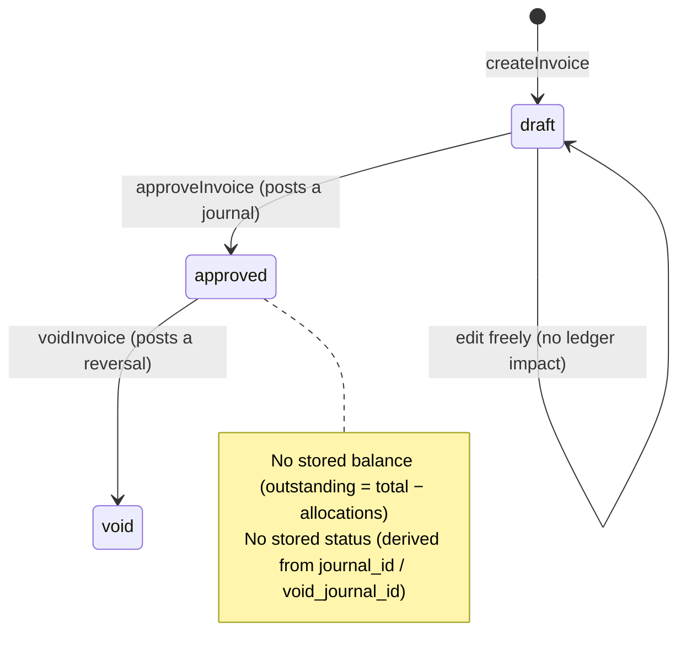
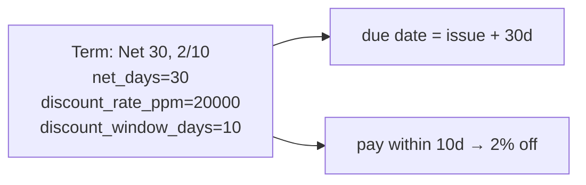
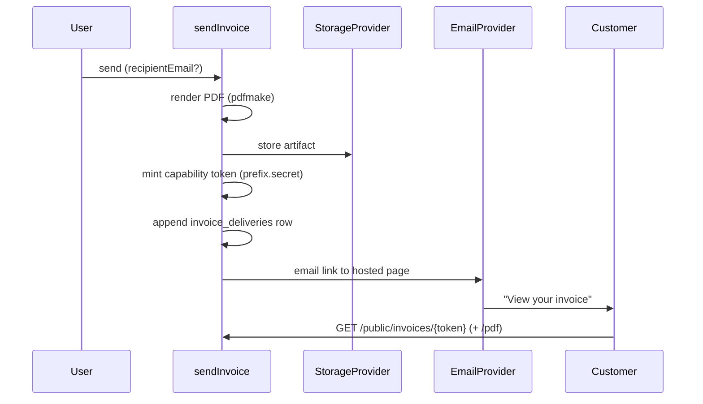
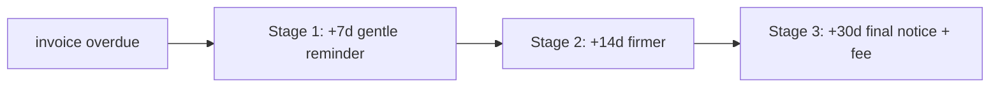

# Sales / Accounts Receivable

Everything about money owed _to_ the business: invoices and credit notes, the terms that govern when
they're due, how they're delivered to the customer, and the automations that raise and chase them.

Source: `packages/server/src/modules/{invoices,invoicing,delivery,branding,payment-terms}`.
Tables: `0005_subledger`, `0007_invoice_delivery`, `0008_recurring_dunning`, `0012_cash_application`.

---

## Invoices & credit notes

An **AR document** is an invoice or a credit note. Both follow the same lifecycle:

- **Draft** is freely editable and touches nothing financial.
- **Approval is the one irreversible step**: it takes a row lock, allocates the document number from
  `document_sequences` (`FOR UPDATE`, gapless), and posts a balanced journal via `postJournal` — all
  in one transaction. An approved invoice debits the org's nominated **receivables control account**
  and credits revenue (and tax).
- **Void** posts a _reversing_ journal (never deletes) and is refused if allocations exist against the
  document.

There is **no stored balance and no stored status** (decisions **D-34**, **D-38**). Tax and rounding
are borrowed from `shared-types/tax/compute.ts` (two rounding points per line, decision **D-35**),
never reimplemented.

Files: `ar-documents.service.ts`, `invoices.service.ts`, `credit-notes.service.ts`.
Tables: `ar_documents`, `ar_document_lines`, `ar_document_line_dimensions`, `document_sequences`.

---

## Payment terms

`payment_terms` defines when a document is due and whether an early payment earns a discount.

- `compute-term.ts` computes the due date and (for "rich" terms) the early-pay discount window and
  amount from `net_days` / `discount_rate_ppm` / `discount_window_days`.
- `resolveDocumentTerm` resolves the effective term: the contact default, overridable per document.
- `suggestion.service.ts::suggestDiscount` is a **pure preview** for a bank-match or money-in screen —
  it never writes or auto-posts (decision **D-43**). The confirmed discount's actual journal +
  allocation is posted elsewhere (bank clearing, or `payments::postSettlementDiscount`).

Terms are gated on `orgs.read`/`orgs.write` rather than a new permission (decision **D-107**). The
same primitive generalises the discount across AP and AR (decision **D-79**). Tables: `payment_terms`.

---

## Delivery — getting the invoice to the customer

`sendInvoice` turns an approved invoice into something the customer can actually see:

- The PDF is rendered with **pdfmake** behind an `InvoiceRenderer` interface (swappable).
- The hosted page is gated by a **per-delivery capability token** (`key_prefix` + SHA-256 hash, no
  expiry, read-only) — the same split-credential pattern as API keys. Served by two **public,
  token-gated endpoints outside `/v1`**: `GET /public/invoices/{token}` (the view) and `.../pdf`.
  The endpoint resolves org → `tenantDb` from the token, so tenant isolation holds below it.
- A resend is a **new row**, never an edit — `invoice_deliveries` rows are evidence (append-only).

Files: `send-invoice.service.ts`, `public-invoice.service.ts`, `renderer/`, `token.ts`.
Tables: `invoice_deliveries` (append-only), `org_branding`.

> The public invoice surface is the one sanctioned unauthenticated read and carries its own security
> review. See [Security](../architecture/security.md#privacy-preserving-surfaces).

---

## Branding

One lazily-created row per org (`org_branding`) holding the invoice letterhead: display name,
address, logo (stored via `StorageProvider`), brand colour, footer.

- `getBranding` never throws — it synthesises a default.
- `updateBranding` uses three-valued patch semantics: **absent** = leave alone, explicit **null** =
  clear.

Kept as its own module so future document types can reach it without an artificial dependency edge.

---

## Recurring invoices & dunning

Standing instructions the **daily tick** (see [scheduling](platform-and-ai.md) /
[automations](#the-daily-tick)) drives.

### Recurring

`recurring_invoice_templates` are materialised into real invoices each cycle through the _ordinary_
`createInvoice`/`approveInvoice` path (draft-or-approved mode). A once-per-cycle guard via
`last_run_date` prevents double-materialisation (decision **D-76**).

### Dunning

`dunning_policies` / `dunning_stages` define a reminder ladder for overdue invoices. The engine walks
the ladder and sends a reminder **once per stage per invoice** (unique key on `dunning_sends`,
decision **D-77**), optionally posting a late fee. Reminders are purely schedule-driven — there is no
"send now" button; the dunning screen's overdue panel reuses the AR aging report.

Both reuse the `invoices.*` permissions rather than owning new ones. Tables:
`recurring_invoice_templates`, `recurring_invoice_template_lines`, `dunning_policies`, `dunning_stages`,
`dunning_sends` (append-only).

### The daily tick

`scheduling::runAsAutomation` runs each engine under a system/automation actor context;
`registerDailyTask`/`startDailyTick` is the cron fan-out; `runDueWorkNow` (behind
`POST /v1/scheduling/run-due-work`) forces an immediate run for testing/ops. See
[Platform & AI → scheduling](platform-and-ai.md#scheduling).

---

## Related reading

- [Foundation](foundation.md) — contacts, tax, control accounts these documents use.
- [Banking & cash](banking-and-cash.md) — how receipts settle these invoices.
- [Reporting & tax](reporting-and-tax.md) — AR aging and revenue reporting.
