# Adding a Feature — End to End

A worked walkthrough of how a change flows through every layer, from schema to screen. Use it as a
checklist. The running example: **adding a "memo" field to bills** (small, but it touches every layer).

The golden rule is **seams first**: pin the exact names — columns, function signatures, permission
keys, wire fields — before you write across layers, so the pieces compose.

---

## The layers a feature crosses

```mermaid
flowchart LR
    SCHEMA["1. Schema<br/>migration + generated.ts"] --> TYPES["2. Wire contract<br/>Zod schema (shared-types)"]
    TYPES --> SVC["3. Service<br/>logic + requirePermission"]
    SVC --> ROUTE["4. Route<br/>transport, arg-mapping only"]
    ROUTE --> SPEC["5. OpenAPI<br/>yarn spec (regenerate)"]
    SPEC --> CLIENT["6. Typed client<br/>yarn codegen (web)"]
    CLIENT --> SCREEN["7. Screen<br/>React + TanStack Query"]
    SCREEN --> TEST["8. Tests<br/>unit + property + (E2E)"]
```



---

## 1. Schema

If the feature needs storage, write (or edit — pre-release) a migration and regenerate the Kysely
types. Follow the full [add-a-table checklist](database-and-migrations.md#adding-a-table-checklist);
for a new column on an existing table it's lighter, but you still regenerate `generated.ts` against a
throwaway DB.

```sql
-- 0009_bill_capture.ts (edited in place, pre-release) — add a nullable column
ALTER TABLE ap_documents ADD COLUMN memo VARCHAR(500) NULL;
```

Then `yarn codegen` against a fresh throwaway DB (see
[regenerating generated.ts](database-and-migrations.md#regenerating-generatedts)).

---

## 2. Wire contract (Zod)

Add the field to the relevant Zod schema in `packages/shared-types`. This schema is simultaneously the
validator, the type, and the OpenAPI source — so define it once.

```ts
// shared-types/src/bills/…
export const createBillRequestSchema = z.object({
  // …existing fields…
  memo: z.string().max(500).nullish(),
});
```

Money fields use the cents-string primitive (`moneyString`), never a number. See
[Money & invariants](../architecture/money-and-invariants.md).

---

## 3. Service

The business logic lives in `src/modules/bills/`. This is the **only** layer that calls
`requirePermission`. It reads the request, does the work through `tenantDb`/`postJournal`/etc., and
returns a result.

```ts
export async function createBill(input: CreateBillInput) {
  const ctx = getContext();
  await requirePermission(ctx, 'bills.write');      // ← authority check, here and nowhere else
  // …validate, resolve terms, insert via tenantDb(ctx.orgId), maybe post a journal…
}
```

If the feature posts to the ledger, it goes through `postJournal` (never a direct journal write) and
carries actor provenance automatically from `ctx`. If it's a write, it will be wrapped in
`withIdempotency` at the route.

---

## 4. Route (transport)

Add or edit the route in `src/transport/routes/`. **Argument-mapping only** — parse with the Zod
schema, call the one service function, map the result. Every write wraps the service call in
`withIdempotency` and requires an `Idempotency-Key`.

```ts
app.post('/v1/bills', { schema: createBillRouteSchema }, async (request, reply) => {
  const result = await withIdempotency(
    { endpoint: 'createBill', request, successStatus: 201 },
    () => createBill(request.body),
  );
  return reply.status(result.status).send(idempotentBody(result));
});
```

Do **not** call `requirePermission` here — dependency-cruiser will (correctly) refuse a transport
import of a repository, and the permission check belongs in the service.

---

## 5. Regenerate the OpenAPI spec

The committed `openapi.json` must match the route table, or the gate's drift check fails:

```bash
yarn workspace @openbooks/server spec     # regenerate openapi.json
```

---

## 6. Regenerate the typed client

The web client's types come from the spec:

```bash
yarn workspace @openbooks/web codegen     # regenerate schema.d.ts from openapi.json
```

Now the SPA's write call **won't compile** without the new field (and, for any write, without an
idempotency key — the header is `required` in the schema).

---

## 7. Screen

In `packages/web/src/screens/purchases/`, wire the field into the form and the mutation. Screens type
everything from `components['schemas'][...]` — never hand-restate a shape. The per-screen `queries.ts`
owns the query keys and invalidates the scope on success:

```ts
const createBill = useMutation({
  mutationFn: (vars: IdempotentVariables<CreateBillBody>) =>
    api.POST('/v1/bills', { body: vars, headers: idempotencyHeader(vars.idempotencyKey) }),
  onSuccess: () => queryClient.invalidateQueries({ queryKey: BILLS_SCOPE }),
});
```

Money goes through `<MoneyInput>`; colours come from design tokens (a raw hex is a lint error). See
[Frontend](../features/frontend.md).

---

## 8. Tests

Cover the change at the layers where it can break:

- **Service test** (real MySQL, via `useTestDatabase`) — the logic, permissions, and any ledger effect.
- **Property test** if it's load-bearing — invariants over a wide input space, checked against the
  trial balance oracle, and confirmed to fail when you break the code.
- **Web test** (`*.test.tsx`) — the form and mutation behaviour.
- **E2E** if it's part of a cross-cutting narrative — but E2E is one story per milestone, not a
  per-feature suite.

See [Testing](testing.md).

---

## 9. Run the gate

```bash
yarn check
```

Format, lint (incl. the custom rules), typecheck, **drift** (this is where a forgotten `yarn spec` or
`yarn codegen` fails), build, and the full test suite. Green means mergeable.

---

## Orchestration note (for parallel/agent work)

From `CLAUDE.md`: when splitting a wave across contributors, **pin the interface contracts first** —
exact field/column names, signatures, token formats — so independently-authored streams compose. A
worktree-isolated author can't run the gate (no `node_modules`); the orchestrator integrates and runs
`yarn check`, which is where parallel work is *proven*. Schema changes need the orchestrator's hand
because `generated.ts` needs a live migrated DB.

---

## Related reading

- [Development](development.md) — the gate, conventions, boundaries.
- [Database & migrations](database-and-migrations.md) — the schema step in full.
- [API & transport](../architecture/api-and-transport.md) — the transport/permissions/spec machinery.
