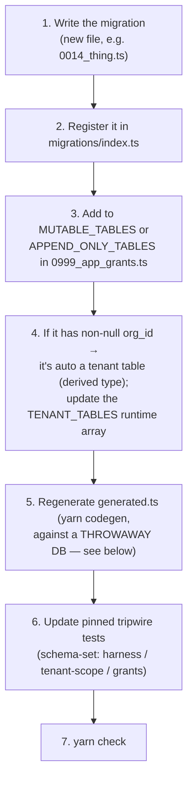

# Database & Migrations

Everything about changing the schema: the conventions, the commands (`migrate`, `codegen`, `drift`),
the two database users, and the runbooks for the situations that bite (in-place edits, codegen against
a throwaway DB).

Background: [Data & tenancy](../architecture/data-and-tenancy.md). Source:
`packages/server/src/db/migrations/` (read its `README.md` before touching the schema).

---

## The commands

```bash
yarn migrate          # apply migrations (needs DATABASE_MIGRATOR_USER/PASSWORD)
yarn migrate:down     # roll back one (dev/test only — production rollback is a restore)
yarn codegen          # regenerate src/db/generated.ts from a live migrated DB
yarn drift            # spec:check + client:check — both generated artifacts must match source
```

`migrate` connects as **`openbooks_migrator`** (the only user with DDL). The running app never does.

---

## Migration conventions

| Convention                                           | Rule                                                                                                                                                            |
| ---------------------------------------------------- | --------------------------------------------------------------------------------------------------------------------------------------------------------------- |
| **Raw SQL**                                          | Migrations use `sql` templates, not Kysely's schema builder — MySQL specifics (`BINARY(16)`, `DATETIME(3)`, `ENUM`, `CHECK`, composite FKs, `REVOKE`) need it.  |
| **Four-digit prefixes**                              | `0001_tenancy`, `0002_ledger`, … applied in lexicographic order. `0004` is permanently retired.                                                                 |
| **`0999_app_grants` runs last**                      | `GRANT` errors on a table that doesn't exist yet, so every granted table must be created earlier. `0999` is the ceiling of the scheme, so "last" is structural. |
| **Static registration**                              | `migrations/index.ts` lists them explicitly (the server bundles to one file — no directory to scan at runtime).                                                 |
| **Money `BIGINT`, UUIDs `BINARY(16)`, dates `DATE`** | Never `DECIMAL`/float; plain byte-order UUIDs; dates read as strings.                                                                                           |
| **Composite `(org_id, id)` keys**                    | Children FK through them, making cross-org references unrepresentable.                                                                                          |
| **In-place edits pre-release** (D-15)                | Migrations are edited, not appended, until first release.                                                                                                       |

---

## Adding a table (checklist)

Adding a table is more than writing the migration — several registries and pinned tests must move with
it. This is the part a subagent gets wrong; do it deliberately.



- Every table lands in **exactly one** of `MUTABLE_TABLES` / `APPEND_ONLY_TABLES` (they must partition
  the schema; a test asserts it), with a one-line rationale comment.
- If the app needs to `UPDATE`/`DELETE` it, it's mutable — and `0999` grants those per-table.
- The pinned schema-set tests (`harness`, `tenant-scope`, `grants`) enumerate table names and will fail
  until they include the new one — updating them is part of the change, not a failure.

---

## Regenerating `generated.ts`

`src/db/generated.ts` is the Kysely types, produced by `kysely-codegen` against a **live, fully
migrated** database (introspection needs the whole schema), connected as the migrator user.

> **You cannot codegen against your running local stack.** Pre-release migrations are edited in place,
> so a new migration sorts _before_ the applied `0999` and `migrate` refuses it. Codegen must run
> against a **throwaway** MySQL migrated fresh with the full set.

The two overrides that matter (baked into the codegen config): `BIGINT → bigint` (precision) and
`DATE → string` (no timezone). See [Data & tenancy → codegen](../architecture/data-and-tenancy.md#code-generation).

A minimal throwaway-DB codegen loop:

```bash
docker compose up -d --wait mysql                              # fresh if you reset first
OPENBOOKS_ROLE=migrate DATABASE_HOST=127.0.0.1 DATABASE_PORT=13307 yarn migrate
DATABASE_HOST=127.0.0.1 DATABASE_PORT=13307 yarn codegen
git diff -- packages/server/src/db/generated.ts                # review the delta
```

---

## Drift: keeping generated artifacts honest

```bash
yarn drift    # = yarn spec:check && yarn client:check
```

- **`spec:check`** regenerates `openapi.json` in-memory from the route table (no DB/network) and diffs
  it against the committed file. If a route changed and you didn't regenerate the spec, this fails.
- **`client:check`** regenerates the web client's `schema.d.ts` from `openapi.json` and byte-compares
  it, restoring the working tree either way.

Order matters: reversed, a route change would report as _client_ drift instead of _spec_ drift. To
regenerate the committed spec after a real route change: `yarn workspace @openbooks/server spec` (then
`yarn workspace @openbooks/web codegen` for the client).

---

## Runbook: reset after an in-place edit

Editing an already-applied migration leaves your local DB inconsistent with the registry, and
`migrate:down` may fail (MySQL DDL/GRANT aren't transactional, so a half-applied `down` can't cleanly
retry). The fix is to drop and recreate:

```sql
DROP DATABASE openbooks;
CREATE DATABASE openbooks
  CHARACTER SET utf8mb4 COLLATE utf8mb4_0900_ai_ci;
```

Then `yarn migrate` again. Testcontainers never hit this — they always start from a fresh DB; it only
bites a long-lived local Compose stack.

```bash
# One-liner against the local Compose MySQL:
docker compose exec mysql mysql -uroot -p"$MYSQL_ROOT_PASSWORD" \
  -e "DROP DATABASE openbooks; CREATE DATABASE openbooks CHARACTER SET utf8mb4 COLLATE utf8mb4_0900_ai_ci;"
OPENBOOKS_ROLE=migrate DATABASE_HOST=127.0.0.1 DATABASE_PORT=13307 yarn migrate
```

---

## The two database users

| User                     | Privileges                                                                        | Provisioned in                               |
| ------------------------ | --------------------------------------------------------------------------------- | -------------------------------------------- |
| **`openbooks_app`**      | `SELECT`, `INSERT` DB-wide; `UPDATE`/`DELETE` per-table on the allowlist. No DDL. | `docker/mysql-init/`, `infra/db-bootstrap/`. |
| **`openbooks_migrator`** | `ALL … WITH GRANT OPTION`.                                                        | Same.                                        |

The grant file (`02-grants.sql`) is **byte-for-byte identical** between Compose and the RDS bootstrap;
`infra/scripts/check-db-bootstrap-parity.sh` fails the build if they diverge. See
[Hosted infra](hosted-infra.md#the-two-db-user-bootstrap).

---

## Related reading

- [Data & tenancy](../architecture/data-and-tenancy.md) — why the schema is shaped this way.
- [Adding a feature](adding-a-feature.md) — the schema step in a full change.
- [Testing](testing.md) — how migrations are validated against real MySQL.
