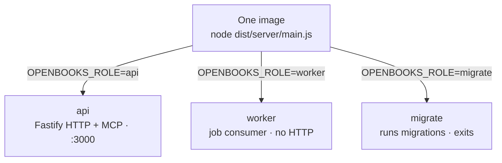
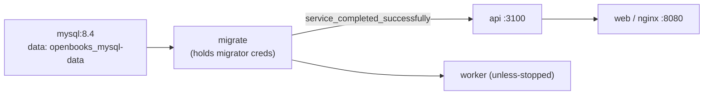
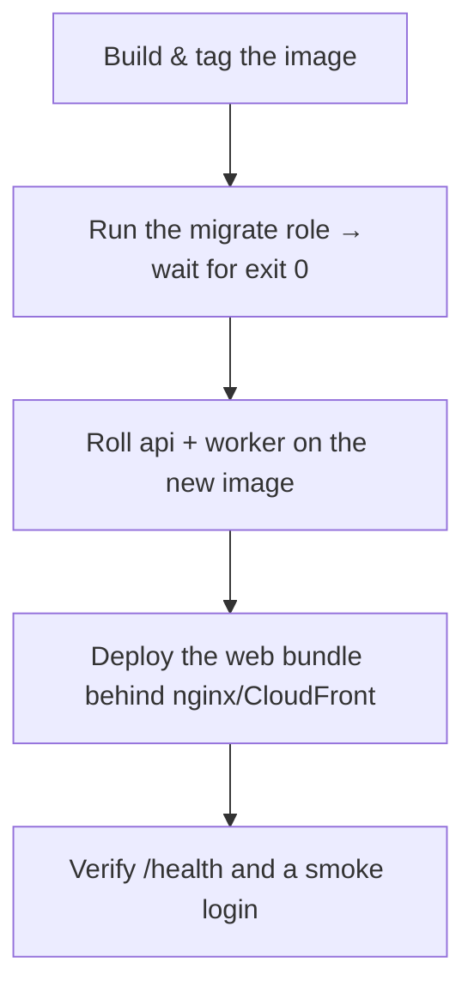

# Deployment

OpenBooks ships as **one Docker image** that runs as `api`, `worker`, or `migrate`. The hosted service
runs the exact artifact you can self-host. This guide covers the image, the Compose production stack,
and how the pieces fit at deploy time. For the AWS topology, see [Hosted infra](hosted-infra.md).

---

## The one-image, three-role model



`main.ts` reads `OPENBOOKS_ROLE` and dynamically imports one of the three. An unrecognised role
**fails at startup**. Nothing in the image branches on which environment it's in. See
[Providers & config → entry points](../architecture/providers-and-config.md#entry-points).

---

## The Docker image

`Dockerfile` is multi-stage. The important stages:

| Stage | Does |
| --- | --- |
| `base` | `node:22.19.0-slim` (Debian, not Alpine — glibc prebuilds for `argon2` are more reliable under `enableScripts: false`). |
| `toolchain` | Copies only manifests, so a source edit doesn't invalidate the install layer. |
| `deps` | `yarn install --immutable` (full, incl. devDeps — esbuild/TS are build inputs). |
| `build` | `yarn build` at the **root** — one canonical production build (also builds the web bundle). |
| `prod-deps` | `yarn workspaces focus @openbooks/server --production` — the server's production closure only. |
| `runtime` | Final app image: `dist` + prod `node_modules`, runs as uid 1000, `HEALTHCHECK` hits `/health` via Node's `fetch`. `CMD ["node", "dist/server/main.js"]`. |
| `web` | Separate `nginx:alpine` stage serving the Vite build + `infra/nginx/openbooks-web.conf`. |

**What's bundled:** esbuild bundles the server entrypoint to `dist/server/main.js` (ESM, `node22`,
sourcemaps, not minified — readable stack traces matter more than bytes). A few packages are kept
**external** and resolved from `node_modules` at runtime: `argon2` (native), `mysql2`, `pino`/`pino-pretty`,
and **`@fastify/swagger-ui`** (it locates its static assets relative to its own `__dirname`; bundled,
that path would break — so it stays a real package that `prod-deps` installs).

**The server image does not ship the web bundle** — the SPA is served as static assets by nginx (or
CloudFront when hosted).

Build it:

```bash
docker compose build          # builds the runtime + web images
```

> **Docker Hub pull hang, once seen locally:** the `credsStore: desktop` helper being consulted on a
> public pull. A throwaway `DOCKER_CONFIG` (empty `auths`) does an anonymous pull; once
> `node:22.19.0-slim` is cached, plain `docker compose build` works.

---

## The Compose production stack

`docker-compose.yml` is a working single-host production stack, not just a dev convenience.



| Service | Role | Restart | Notes |
| --- | --- | --- | --- |
| **mysql** | — | — | Runs `docker/mysql-init/*.sql` once (creates the two DB users + grants). Published on `13307`. TCP healthcheck. |
| **migrate** | `migrate` | `no` | The **only** service with `DATABASE_MIGRATOR_*` credentials. Runs to completion. |
| **api** | `api` | default | Gated on `migrate` completing. Published on `3100`. |
| **worker** | `worker` | `unless-stopped` | A clean exit is an outage — it blocks on the queue. |
| **web** | (nginx) | default | Published on `8080`. Depends only on `api` being *started*. |

Migrations are always a **discrete job** — `api`/`worker` do not start until `migrate` exits zero.
This is the same discipline in production: run the `migrate` role, wait for exit 0, then roll the app.

Update the persistent stack:

```bash
docker compose build && docker compose up -d
```

---

## Configuration at deploy time

Everything is environment-driven and **validated at startup** (fail-fast — a bad config never becomes
a running-but-wrong server). See [Providers & config](../architecture/providers-and-config.md).

The categories in `.env.example`:

| Category | Keys (examples) |
| --- | --- |
| Process | `OPENBOOKS_ROLE`, `NODE_ENV`, `LOG_LEVEL` |
| HTTP | `HTTP_HOST`, `HTTP_PORT` (internal), `API_HOST_PORT`/`WEB_HOST_PORT` (published) |
| Database | `DATABASE_HOST/PORT/USER/PASSWORD/NAME/POOL_SIZE`; `DATABASE_MIGRATOR_*` (migrate role only) |
| Sessions | `SESSION_SECRET`, `SESSION_COOKIE_SECURE`, `SESSION_COOKIE_DOMAIN` |
| CORS | `CORS_ALLOWED_ORIGINS` (rejects `*`; requires `SESSION_COOKIE_DOMAIN` when set) |
| Providers | `QUEUE_PROVIDER`, `STORAGE_PROVIDER`, `SECRETS_PROVIDER`, `EMAIL_PROVIDER`, `*_EXTRACTION`, inbound-mail, bank-feed |
| AWS (hosted) | region + per-provider vars (SQS/S3/Secrets Manager/SES) |
| Misc | `APP_BASE_URL` (unset → invite links are relative), `SECRETS_ENCRYPTION_KEY` |

**Production musts:** set a real `SESSION_SECRET`, `SESSION_COOKIE_SECURE=true` behind HTTPS,
`APP_BASE_URL` to the public origin, and a strong `SECRETS_ENCRYPTION_KEY` if using the `local` secrets
provider.

---

## Running the app from the host (proven flow)

For a production-like run without full Compose (e.g. behind your own proxy): Compose MySQL on 13307,
then run the roles as host processes with the internal-port env overridden. See
[Getting started → host-process loop](getting-started.md#option-b--the-host-process-dev-loop-fastest-iteration)
for the exact invocation; production differs only in `NODE_ENV=production`,
`SESSION_COOKIE_SECURE=true`, and real secrets.

---

## Health & observability

- **`/health`** — liveness, used by the container `HEALTHCHECK` and any load balancer.
- **Logs** — structured JSON via pino, every line carrying actor provenance
  ([provenance](../architecture/money-and-invariants.md#provenance)). `pino-pretty` is dev-only.
- **`/docs`** — Swagger UI over the committed `openapi.json`.

---

## Deploy checklist



- Migrations are a **pre-deploy job**, never a boot step.
- Roll `api`/`worker` only after `migrate` succeeds.
- The web bundle deploys separately (static assets).

---

## Related reading

- [Hosted infra](hosted-infra.md) — the AWS/Terraform topology and DB bootstrap.
- [Providers & config](../architecture/providers-and-config.md) — the seams and validation.
- [CI](../ci.md) — build & (would-be) publish pipeline.
