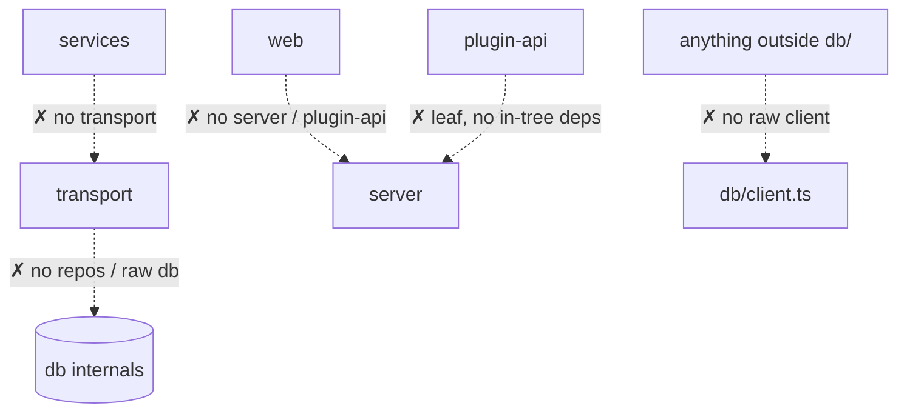

# Development Guide

How to work in the codebase day to day: the gate that must stay green, the conventions the compiler
and lint enforce, and the architectural boundaries you cannot cross by accident.

---

## The gate: `yarn check`

One command is the contract. If it's green, your change is mergeable; if it's red, it isn't. It runs
eight steps in order:

```bash
yarn check
# = format:check && lint && lint:tokens && lint:deps && typecheck && drift && build && test
```

| Step | Command | Checks | Typical time |
| --- | --- | --- | --- |
| `format:check` | `prettier --check .` | Formatting only (100 col, single quotes, semicolons, trailing commas). | ~5s |
| `lint` | `eslint .` | typescript-eslint + the four custom `openbooks/*` rules. | ~11s |
| `lint:tokens` | `bash .github/scripts/check-token-lint.sh` | That `no-raw-color` is still *wired in* at `error` (see note below). | ~4s |
| `lint:deps` | `depcruise packages --config .dependency-cruiser.cjs` | Architectural boundaries (see below). | ~1s |
| `typecheck` | `tsc --noEmit` per workspace | Strict TypeScript across all packages. | ~3s |
| `drift` | `yarn spec:check && yarn client:check` | OpenAPI spec + generated client match the code. | ~3s |
| `build` | esbuild server + Vite web | That it actually bundles. | ~2s |
| `test` | `vitest run` | Full suite incl. real MySQL. | ~2m |

> **`build` is in the gate on purpose.** A real regression (Tailwind emitting invalid CSS for any
> file containing the word `container`) once passed typecheck, lint, *and* the whole test suite but
> broke `yarn build`. The gate now bundles.

> **Heads-up on `lint:tokens`.** In the current checkout `.github/scripts/check-token-lint.sh` is an
> empty (0-byte) file, so this step passes without asserting anything. Its intended job is to prove
> the `openbooks/no-raw-color` rule is still bound at `error` severity for `packages/web`. If you rely
> on that gate, restore the script (its history is recoverable via
> `git log -p -- .github/scripts/check-token-lint.sh`). The rule itself still runs under `yarn lint`.

Useful subsets while iterating:

```bash
yarn lint                 # just eslint
yarn typecheck            # just types
yarn test:web             # web tests only (jsdom, no Docker)
yarn test:watch           # watch mode
yarn workspace @openbooks/server test   # server tests only
```

---

## Repository tour

```
packages/
  plugin-api/      The posting contract (interface). A leaf — depends on nothing in-tree.
  shared-types/    Zod schemas + the Money primitive + tax compute.
  server/          Everything server-side (see below).
  web/             The React SPA.
  eslint-plugin/   The four custom lint rules.
  e2e/             Playwright narratives.

packages/server/src/
  config/          Validated configuration (the only place process.env is read).
  context/         AsyncLocalStorage request context (frozen).
  db/              tenantDb / systemDb, migrations, generated.ts, transaction-scope.
  entrypoints/     main.ts → api | worker | migrate.
  errors/          The error taxonomy + wire serialization.
  logging/         pino + the provenance mixin.
  modules/         The business subsystems (one folder each). Services live here.
  providers/       The swappable seams (queue, storage, secrets, email, …).
  transport/       Fastify app, routes, OpenAPI generation, idempotency.
```

A **module** typically contains `*.service.ts` (business logic, calls `requirePermission`),
`*.repository.ts` (data access), and `index.ts`. Routes for it live in `src/transport/routes/`.

---

## Conventions the compiler enforces

- **Extensionless imports** — `moduleResolution: Bundler`. Write `import { x } from './foo'`, never
  `./foo.js`.
- **Strict TypeScript** with `noUncheckedIndexedAccess` and `exactOptionalPropertyTypes`. **No `any`**
  in `src`. Use `import type` for type-only imports.
- **No `console.*`** — use the logger (it attaches provenance automatically).
- **No `process.env`** outside `src/config/`.
- **Zod is v4** — check installed behaviour rather than assuming v3 idioms.
- **Prettier**: 100 col, single quotes, semicolons, trailing commas.

### Comments explain *why*, not *what*

Ordinary code gets no commentary. A decision that took measuring to reach gets the measurement written
down, citing the spec section or roadmap decision. The register to match:
`db/migrations/0999_app_grants.ts`, `db/transaction-scope.ts`, `modules/ledger/posting.service.ts`.

---

## The four custom lint rules

Source: `packages/eslint-plugin/src/rules/`.

| Rule | Bans | Where |
| --- | --- | --- |
| **`no-float-money`** (type-aware) | Arithmetic (`+ - * / %`), `Number()`, `Math.*`, compound assignment on `Money`-typed operands. | `packages/{server,shared-types}`. Use the `add`/`subtract`/`sum`/`allocate` helpers. |
| **`no-journal-writes`** | `insertInto`/`updateTable`/`deleteFrom` on `journals`/`journal_lines`. | Everywhere except an allowlist (`posting.repository.ts`, migrations, test factories). |
| **`no-process-env`** | Any `process.env` access. | Everywhere except `config/**` and a few carved-out tooling files. |
| **`no-raw-color`** | Hex / `rgb()` / `oklch()` / Tailwind arbitrary colours in `.tsx`. | `packages/web` except `src/styles/`. Use design tokens. |

---

## Architectural boundaries (dependency-cruiser)

`lint:deps` enforces *what a file may reach* — complementary to ESLint's *what a file does*. The rules
in `.dependency-cruiser.cjs`:



| Rule | Enforces |
| --- | --- |
| `no-raw-db-outside-db-module` | Only `src/db/**` imports the raw Kysely client. |
| `transport-holds-no-business-logic` | Transport can't import a `*.repository.ts` or reach into `src/db/` (except `index.ts`). |
| `services-do-not-import-transport` | Services can't import transport (one carve-out: the MCP host, which may import only the `App` type alias). |
| `plugin-api-is-a-leaf` | `plugin-api` depends on nothing else in the tree. |
| `web-uses-the-public-api-only` | `web` imports neither `server` nor `plugin-api`. |
| `no-circular` | No circular dependencies. |
| `no-dev-deps-in-src` | Production `src/` can't depend on a dev dependency. |

If you find yourself wanting to work around one of these, that's the signal to stop and reconsider the
design — the boundary is usually protecting an invariant.

---

## The non-negotiables (from `CLAUDE.md`)

These are enforced by the build, not by convention. Full detail is in the architecture docs; the
short list:

1. **Journals are append-only at the database level.** Corrections are reversing entries. See
   [Ledger kernel](../architecture/ledger-kernel.md).
2. **Two database users** — the app never holds `UPDATE`/`DELETE` on journals.
3. **Money is `bigint` minor units end to end**, a cents-string on the wire. See
   [Money & invariants](../architecture/money-and-invariants.md).
4. **Tenant tables are only reachable through `tenantDb(orgId)`.** See
   [Data & tenancy](../architecture/data-and-tenancy.md).
5. **Transactions propagate ambiently.**
6. **A cross-org read is 404, never 403.**
7. **Only `posting.repository.ts` writes journals.**
8. **Transport holds no business logic.**

---

## Related reading

- [Adding a feature](adding-a-feature.md) — the end-to-end change walkthrough.
- [Testing](testing.md) — the test philosophy and how to run each layer.
- [Database & migrations](database-and-migrations.md) — schema changes.
