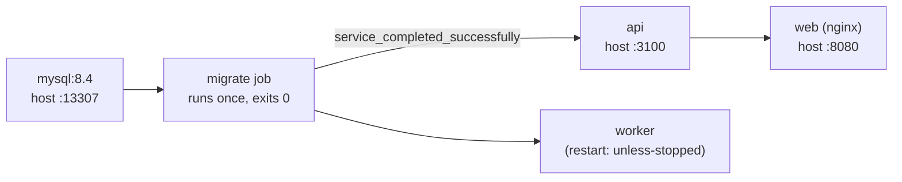

# Getting Started

Two ways to run OpenBooks locally: the **Compose stack** (closest to production, one command) and the
**host-process dev loop** (fastest inner loop for writing code). This guide covers both, plus the
prerequisites they share.

---

## Prerequisites

| Tool       | Version                  | Notes                                                                                                                                |
| ---------- | ------------------------ | ------------------------------------------------------------------------------------------------------------------------------------ |
| **Node**   | `22.19.0` (see `.nvmrc`) | `nvm use` picks it up. `engines` requires `>=22.11.0`.                                                                               |
| **Docker** | with Compose v2          | Required for the stack _and_ for tests (testcontainers).                                                                             |
| **Yarn**   | **do not install**       | Yarn 4.17.1 is committed at `.yarn/releases/` and pinned by `packageManager`. Do **not** `corepack enable` or install Yarn globally. |

```bash
git clone https://github.com/ianberryman/OpenBooks.git
cd OpenBooks
nvm use
yarn install
```

> The `yarn` on your PATH is likely Yarn 1 and won't read the pinned path. The repo's scripts and the
> Dockerfile invoke the pinned binary explicitly; for your own commands, `yarn <cmd>` inside the repo
> resolves correctly via `packageManager`.

---

## Option A — the Compose stack (one command)

This brings up MySQL, runs migrations as a discrete job, then starts the API, worker, and web
frontend.

```bash
cp .env.example .env      # documents every variable; dev-safe defaults are marked
docker compose up
```

What comes up:



| Service                             | Host port                      | Why that port                                                                                                                                                                            |
| ----------------------------------- | ------------------------------ | ---------------------------------------------------------------------------------------------------------------------------------------------------------------------------------------- |
| **web** (nginx SPA + reverse proxy) | `8080` (`WEB_HOST_PORT`)       | The app you open in a browser.                                                                                                                                                           |
| **api**                             | `3100` (`API_HOST_PORT`)       | 3100 dodges the commonly-bound 3000.                                                                                                                                                     |
| **mysql**                           | `13307` (`DATABASE_HOST_PORT`) | **13307, not 3306** — a host `mysqld` usually owns 3306, and a clash makes Docker fall back to IPv6-only, so host-side `yarn migrate`/`codegen` would silently hit the _wrong_ database. |

> **Internal vs host ports.** `DATABASE_PORT`/`HTTP_PORT` are what the processes bind _inside_ the
> Compose network (3306/3000) — **never** change these to dodge a host clash; that silently repoints
> the app. Only the `*_HOST_PORT` values are yours to move.

Open **http://localhost:8080**, register an org, and you're in.

> **Reminder:** migrations never run on container boot. They are a discrete `migrate` job; `api` and
> `worker` wait for it to exit zero. This mirrors production exactly.

---

## Option B — the host-process dev loop (fastest iteration)

Run MySQL in Compose but the API and web as host processes with hot reload. This is the loop to use
while writing code.

**1. Bring up just MySQL and migrate it:**

```bash
docker compose up -d --wait mysql
OPENBOOKS_ROLE=migrate DATABASE_HOST=127.0.0.1 DATABASE_PORT=13307 yarn migrate
```

**2. Start the API (hot-reloading) in one terminal:**

```bash
DATABASE_HOST=127.0.0.1 DATABASE_PORT=13307 HTTP_PORT=3100 \
QUEUE_PROVIDER=in-process SESSION_COOKIE_SECURE=false \
OPENBOOKS_ROLE=api yarn workspace @openbooks/server dev
```

Under `QUEUE_PROVIDER=in-process`, the API registers all job handlers and the daily tick in-process —
so recurring invoices, dunning, imports, and OCR all run without a separate worker.

**3. Start the web dev server in another terminal:**

```bash
yarn workspace @openbooks/web dev      # Vite on :5173, proxies /v1 & /health to :3100
```

Open **http://localhost:5173**. The Vite proxy forwards `/v1`, `/health`, `/public`, `/artifacts`,
`/oauth`, `/mcp` to the API — same-origin, which the `SameSite=Lax` session cookie needs.

> Vite binds `localhost` (IPv6) by default. To reach it from a phone on your LAN, add
> `--host 0.0.0.0` — and note macOS may firewall `node`'s inbound connections.

---

## Seeding a demo org over the API

If you want to script setup rather than click through the UI, note these gotchas (every write needs an
`Idempotency-Key`):

- `register` requires a nested `org` object:
  `{ name, chartTemplateId: 'general_small_business', fiscalYearStartMonth }`.
- The fiscal-year field is `fiscalYear` (not `year`).
- The bank ledger account is code `1010`.

---

## Verify your setup

Run the gate. It's the single command that proves everything works:

```bash
yarn check
```

This runs format, lint, typecheck, spec/client drift, build, and the full test suite (real MySQL via
testcontainers — Docker must be running). Expect ~3 minutes; `test` dominates. See
[Development → the gate](development.md#the-gate-yarn-check).

---

## Common first-run issues

| Symptom                                                             | Cause & fix                                                                                                                                                                                |
| ------------------------------------------------------------------- | ------------------------------------------------------------------------------------------------------------------------------------------------------------------------------------------ |
| `Access denied` from `yarn migrate`/`codegen`                       | You're hitting a host `mysqld` on 3306 instead of Compose on 13307. Set `DATABASE_PORT=13307` (and `DATABASE_HOST=127.0.0.1`).                                                             |
| Login "works" then every request 401s                               | A stale session cookie, or `SESSION_COOKIE_SECURE=true` over plain HTTP. Set `SESSION_COOKIE_SECURE=false` for local HTTP.                                                                 |
| Blank page, opaque JSON-parse error in dev                          | An API path isn't proxied by Vite (SPA fallback served `index.html`). Check `vite.config.ts`'s proxy list.                                                                                 |
| `migrate:down` fails / schema looks wrong after editing a migration | Pre-release migrations are edited in place; your local DB is now inconsistent. Drop & recreate — see the [reset runbook](database-and-migrations.md#runbook-reset-after-an-in-place-edit). |

---

## Where to go next

- Understand the codebase: [Architecture overview](../architecture/overview.md).
- Start writing code: [Development](development.md) and [Adding a feature](adding-a-feature.md).
- The database workflow: [Database & migrations](database-and-migrations.md).
