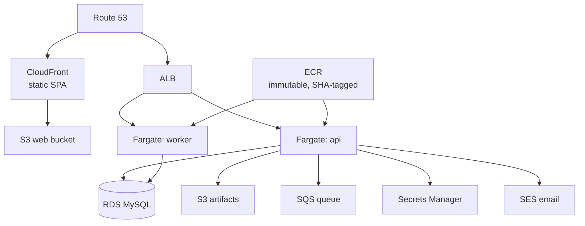
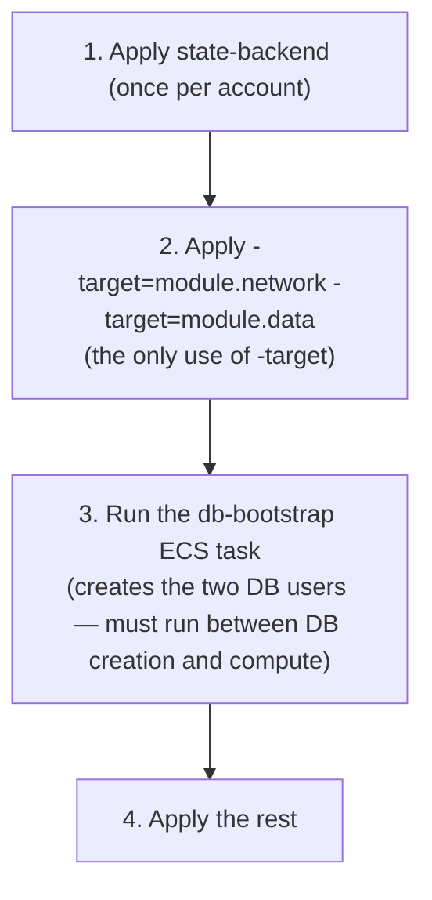

# Hosted Infrastructure

The hosted topology is defined in `infra/terraform/`. It runs the **same Docker image** as self-host,
on AWS. This guide describes the topology, the deliberate "never applied" status, and the two-DB-user
bootstrap that is shared byte-for-byte with the Compose stack.

> **Status (decision D-05): this Terraform has never been applied.** No AWS account exists for the
> project, so `terraform plan` has never run against a real provider. What *is* verified:
> `terraform fmt -check` is clean, and `init -backend=false && validate` succeeds for both roots. Treat
> the topology as a validated design, not a running system.

---

## The topology



- The SPA is static, served from **CloudFront**; the API and worker run on **Fargate** behind an
  **ALB**; state lives in **RDS MySQL**.
- The hosted **provider adapters** light up here: `sqs` queue, `s3` storage, `aws-secrets-manager`
  secrets, `ses` email — selected by env, same image. See
  [Providers & config](../architecture/providers-and-config.md).
- Deployed images are **`linux/arm64`** (ARM64 Fargate task defs), tagged by **commit SHA only**
  against an **immutable** ECR repo — no moving `develop` tag.

---

## Terraform layout

```
infra/terraform/
  env/            per-environment tfvars + .backend.hcl (hosted-prod, staging)
  modules/        network · data · messaging · compute · edge
  state-backend/  a separate root that creates the S3 state bucket (local state)
```

- **Separate backend config files per environment** (not Terraform workspaces) — specifically so a
  careless `workspace select` can't apply staging's plan to production.
- **Modules carry no provider config** of their own, so they aren't independently `validate`-able
  standalone; `modules/edge` needs a `configuration_aliases` entry for the `us-east-1` CloudFront-ACM
  provider.
- **`state-backend/` is its own root with local state** (it creates the very bucket the main root's
  state would live in). Applied once per AWS account.
- Version pin: Terraform `>= 1.9.0, < 2.0.0`; `.terraform.lock.hcl` committed with pinned provider
  checksums.

Validate locally (no credentials needed):

```bash
bash infra/scripts/tf-validate.sh      # fmt -check + validate on both roots
```

---

## Bootstrap sequence

Documented in `infra/terraform/README.md`:



`-target` is used exactly once, because the DB-user bootstrap task must run *between* the database
existing and the compute existing.

---

## The two-DB-user bootstrap

`infra/db-bootstrap/` provisions the same two users the whole system depends on
([Data & tenancy](../architecture/data-and-tenancy.md#the-two-database-users)):

- **`01-users-rds.sql`** — RDS-specific; creates `openbooks_migrator` and `openbooks_app`. Passwords
  are injected via an **unquoted shell heredoc** expanding `${MIGRATOR_PASSWORD}` / `${APP_PASSWORD}`.
  Only those two variable references are permitted — a backtick or `$(...)` anywhere (even in a
  comment) would be a shell-injection risk, since the whole file is interpreted.
- **`02-grants.sql`** — **shared byte-for-byte** with `docker/mysql-init/02-grants.sql`. Grants
  `ALL … WITH GRANT OPTION` to the migrator and only `SELECT, INSERT` (no `UPDATE`/`DELETE`/DDL) to the
  app user. The `UPDATE`/`DELETE` the app *does* need comes per-table from `0999_app_grants`.

### The parity guard

```bash
bash infra/scripts/check-db-bootstrap-parity.sh
```

Two checks, run together:

1. **Shell-injection safety** — greps `01-users-rds.sql` for backticks, `$(`, or any variable
   reference other than the two passwords (this caught a real bug once — a backtick in a prose
   comment).
2. **Byte-for-byte parity** — `cmp` between `infra/db-bootstrap/02-grants.sql` and
   `docker/mysql-init/02-grants.sql`; prints a diff and fails on divergence.

This is why the grant model can be trusted to be identical across Compose, testcontainers, and RDS.

---

## nginx (same-origin proxy)

Whether self-hosted via Compose or fronted differently, `infra/nginx/openbooks-web.conf` serves the
SPA (`try_files … /index.html` for client routing) and reverse-proxies `/v1/`, `/health`, `/oauth/`,
`/mcp`, `/docs` to the API — **same-origin**, mirroring the Vite dev proxy. It re-resolves the `api`
upstream per request (via Docker's embedded DNS) so a redeploy doesn't leave nginx pinned to a stale
container IP.

---

## Related reading

- [Deployment](deployment.md) — the image and Compose stack.
- [Data & tenancy](../architecture/data-and-tenancy.md) — the two-DB-user model this bootstraps.
- [Providers & config](../architecture/providers-and-config.md) — the hosted adapters.
