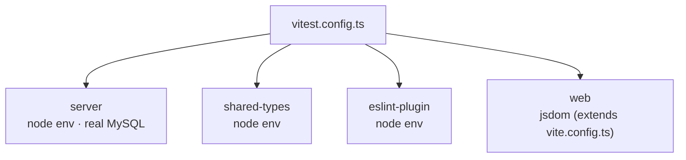

# Testing

OpenBooks tests against **real MySQL 8, never SQLite, never mocks** (spec §11). This is not dogma —
the ledger's guarantees are database guarantees (grants, locks, unique indexes, CHECK constraints), and
a mock proves nothing about them. This guide covers how the suite is wired and the two testing habits
the project has earned the hard way.

---

## Running tests

```bash
yarn test              # full suite — server (real MySQL) + shared-types + eslint-plugin + web
yarn test:web          # web project only (jsdom, no Docker needed)
yarn test:watch        # watch mode
yarn workspace @openbooks/server test   # server project only
```

Docker must be running for anything that touches the server project — testcontainers starts a real
MySQL. Expect the full suite around ~2 minutes; the container and the property tests dominate.

---

## How the suite is wired

`vitest.config.ts` defines four projects:



| Project           | Environment | Notes                                                                                                                                                                                                                  |
| ----------------- | ----------- | ---------------------------------------------------------------------------------------------------------------------------------------------------------------------------------------------------------------------- |
| **server**        | node        | `globalSetup` starts **one shared MySQL 8 testcontainer** for the whole suite and migrates it. `fileParallelism: false` — ledger suites share one DB, and parallel files would interleave writes across property runs. |
| **shared-types**  | node        | Pure unit tests (money, tax compute).                                                                                                                                                                                  |
| **eslint-plugin** | node        | Rule-tester tests for the four custom rules.                                                                                                                                                                           |
| **web**           | jsdom       | testing-library; API calls stubbed by replacing `globalThis.fetch` at import time.                                                                                                                                     |

---

## The test database harness

`packages/server/test/db/harness.ts` gives each test:

```ts
const db = useTestDatabase();
// db.app       — Kysely connected as openbooks_app (the REAL production identity)
// db.migrator  — DDL / reset-capable handle
// db.factories — builders for orgs, accounts, journals, …
// db.reset()   — deletes every non-seed row (permissions/roles/role_permissions protected)
```

**Tests connect as `openbooks_app`** — the same restricted user production uses. So a test that asserts
"the app cannot UPDATE a journal" is proving a fact about production, not about a permissive test
superuser. `test/enforcement/grants.test.ts` does exactly this.

For genuine concurrency, `openAppConnection()` opens a **separate physical connection** as the app
user — necessary because a pooled handle can serialise two "concurrent" statements onto one connection
and defeat a race test.

---

## Habit 1: prove contention, don't assume it

A sequential simulation of a race **passes against code that has no locking at all** — so it proves
nothing. Real concurrency tests park one transaction mid-flight and assert the other has _not_ settled:

```mermaid
sequenceDiagram
    participant A as Connection A
    participant B as Connection B
    A->>DB: BEGIN; SELECT … FOR UPDATE (holds the lock)
    B->>DB: BEGIN; SELECT … FOR UPDATE (blocks)
    Note over B: assert B has NOT settled yet — proves the lock exists
    A->>DB: COMMIT
    B->>DB: now proceeds
```

This is how the posting/period-lock races (A9) and the idempotency race (A8) are tested. Use
`openAppConnection()` for the second connection.

---

## Habit 2: mutation-test anything load-bearing

A suite that has never failed is of unknown value. Two mutations once passed the _entire_ example
suite and were caught only by property tests — including **permuting accounts in a reversal instead of
swapping sides**, which is _identical to correct_ on a two-line journal, and two-line journals were all
the example suite posted.

The lesson: for load-bearing logic, write **property tests** (via `fast-check`) that generate a wide
space of inputs and check invariants, and confirm they actually _fail_ when you deliberately break the
code.

```ts
// The shape: generate random balanced journals, post them against real MySQL,
// then assert an invariant against the trial balance (the oracle).
fc.assert(
  fc.property(arbitraryBalancedJournal(), async (j) => {
    await postJournal(j, ctx);
    const tb = await getTrialBalance(ctx);
    expect(sumDebits(tb)).toEqual(sumCredits(tb)); // must hold for ANY input
  }),
);
```

One banking property suite computes the cleared balance **four independent ways over four tables** and
asserts they're equal — the subledger-agreement invariant one level down.

The trial balance is the **oracle**: report code is checked by computing the same figure a second,
independent way and asserting equality. See [Reporting & tax](../features/reporting-and-tax.md).

---

## End-to-end (Playwright)

`packages/e2e` is **one narrative per milestone, not a suite** (decision **D-26**): "a person can run a
month of books in a browser." Deliberately not sharded — `workers: 1`, `retries: 0` (a retried E2E that
passes on attempt 2 hides the exact information the test exists to produce).

```bash
yarn e2e:install       # once per machine — installs Playwright + chromium
yarn e2e               # runs the narratives
```

- The E2E `webServer` config **spins up the whole stack itself** — Compose MySQL, migrate, the API,
  and Vite — on distinct ports (`API_PORT=3110`, `WEB_PORT=5183`) so it won't collide with your own
  `yarn dev` session.
- Each narrative registers a **fresh org/user** per run, so it's idempotent against a stale or empty
  DB.

The narratives (all authored and `yarn check`-clean, run via `yarn e2e`, not part of the default gate):
the M1–M4 milestone stories plus `cash-basis`, `quickbooks-import`, `recurring-and-dunning`,
`bill-capture`, `platform-oauth-mcp`, `payment-integration`, and `cash-application`.

> E2Es have repeatedly earned their keep: the cash-basis narrative caught a real transport defect
> (`basis` never crossed the wire schema), and the M4 narrative caught two seam defects. A browser
> narrative exercises the seams the unit tests stub.

---

## What the default gate does _not_ run

`yarn check` runs `vitest run` but **not** `yarn e2e` — the E2E narratives are stack-runnable but
separate. Run them explicitly when touching a cross-cutting flow.

---

## Related reading

- [Money & invariants](../architecture/money-and-invariants.md) — the property/mutation philosophy in full.
- [Database & migrations](database-and-migrations.md) — the schema the tests run against.
- [CI](../ci.md) — how these run (or would run) in the pipeline.
